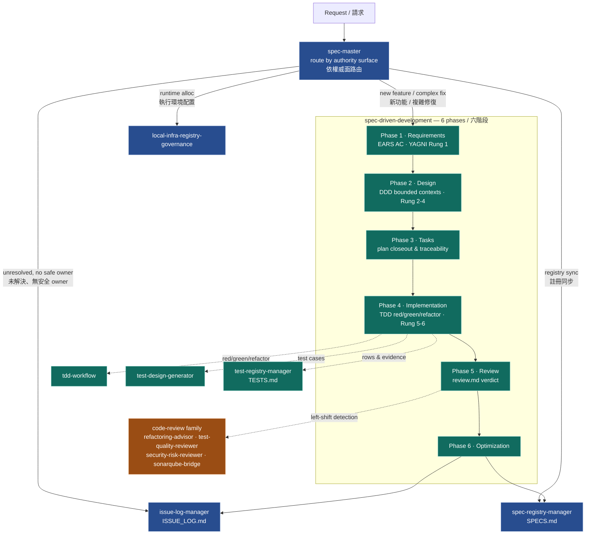
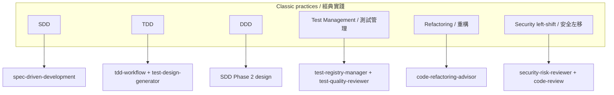

# The Spec Master Method — Methodology Diagram / 方法論圖

> Renders on GitHub automatically. The skills are color-grouped into the three layers
> of the method: **govern & route**, **deliver**, and **verify (left-shift)**.
> 在 GitHub 上會自動渲染。skills 依方法的三層上色：**治理與路由**、**交付**、**驗證（左移）**。

## 1. Skill handoff across the six SDD phases / 六階段中的 skill 交棒



## 2. One-way evidence flow / 單向證據流

The method's core anti-false-green rule: evidence only flows **up** into derived summaries; derived summaries **never** sync back into upstream truth.

此方法防止 false-green 的核心規則：證據只**向上**流入衍生摘要；衍生摘要**永不**反向同步回上游真相。

```mermaid
flowchart LR
    A["ISSUE_LOG.md<br/>unresolved / 未解決"] --> B["spec artifacts & reports<br/>requirements · design · tasks · code"]
    B --> C["folder-level TESTS.md<br/>rows & evidence refs"]
    C --> D["workspace test rollup"]
    D --> E["RTM.md<br/>requirement traceability"]
    E --> F["SPECS.md<br/>stable registry summary"]

    R["review.md<br/>readiness verdict — authority"] -.owns.-> READY(("demo / release<br/>readiness"))

    F -. "must NOT sync back / 禁止反向同步" .-> B
    linkStyle 6 stroke:#c0392b,stroke-width:2px,color:#c0392b;
```

## 3. Practice → owner skill map / 實踐 → owner skill 對照


