# Code Review / Code Graph 血緣關係（provenance lineage）

這份文件從 **來源 repo 的視角** 說明 `code-review` 家族(binaries + skills + code graph)的單向血緣：
**① 本 repo 編譯 binaries + 撰寫 skills → ② 發布到 global skills → ③ 下游專案 vendoring 使用**。

目的：讓任何人(或 agent)在動到 binary、skill、發布腳本之前，先看懂這條鏈的**單向資料流**與**邊界** —— skill 本體一律在來源 repo 改、往下游流，不從下游回推。

> **本檔角色**：source-of-truth 的血緣說明,隨 skill 一起發布、被下游 vendoring。下游專案的「專案端」細節(語料邊界、graph DB、git hook、LFS 政策)由各專案自己的文件記錄,不在此檔。

## 一張圖看懂

```mermaid
flowchart LR
    subgraph S1["① 來源 repo（本 repo）"]
        direction TB
        SRC["Go source<br/>(review-cli)"]
        MK["go-review-service/Makefile<br/>make build-all-zig / build-all-lsp"]
        SKAUTH[".agents/skills/ (canonical 撰寫處)<br/>code-review + siblings"]
        SRC --> MK --> BIN6["6 顆 review-cli-&lt;os&gt;-&lt;arch&gt;"]
        BIN6 -->|make package-skill| SKAUTH
    end

    subgraph S2["② 發布到 global skills"]
        GLOBAL["~/.claude/skills/ · ~/.config/opencode/skills/<br/>~/.kiro/skills/ · ~/.codex/skills/ · ~/.gemini/antigravity/skills/"]
    end

    subgraph S3["③ 下游專案 vendoring（例：giant-ax）"]
        VEND["專案的 skills 目錄<br/>(.kiro/skills 或 .agents/skills)"]
        CONSUME["專案端消費<br/>no-embedding 圖譜 · graph.sqlite · git hooks"]
        VEND --> CONSUME
    end

    SKAUTH -->|scripts/publish_code_review_skill.py --build zig| GLOBAL
    GLOBAL -->|rsync -a| VEND

    style S1 fill:#eef
    style S2 fill:#efe
    style S3 fill:#fee
```

**單向流**：來源 repo → global → 下游專案。**改 skill 本體請在來源 repo 改**,重新發布,下游 re-sync 取得;下游不回寫上游。

---

## ① 來源 repo：編譯 binaries + 撰寫 skills

- **CLI 本體是 Go 寫的** `review-cli`,由 `go-review-service/Makefile` 交叉編譯：
  - `make build-all-zig` — 用 Zig cross-compiler 出 linux / windows 的 **tree-sitter AST** 版;darwin 因無 macOS SDK 降級為 **LSP-only**(Python/TS/C# 的 AST 規則在 darwin 降級並誠實標註)。
  - `make build-all-lsp` — 純 Go、無 CGO、全平台 LSP-only 版(fallback)。
- 產出 **6 顆 binary**：`review-cli-{linux,darwin}-{amd64,arm64}` + `review-cli-windows-{amd64,arm64}.exe`。`make package-skill` 把它們放進 `.agents/skills/code-review/scripts/`。
- **skill 家族的 canonical 撰寫處是 `.agents/skills/`**:`code-review`(binary 驅動的主 skill)+ 純 Python siblings(`capability-mapper`、`code-summarizer`、`test-quality-reviewer`、`code-refactoring-advisor`、`test-design-generator`、`security-risk-reviewer`、`sonarqube-bridge`)。siblings 由 `scripts/publish_code_review_skill.py` 的 SIBLING_SKILLS allow-list 定義。
- **版本**由 git tag + `CHANGELOG.md` 管理(SemVer,pre-1.0)。binary 自報字串為 `Code Review System vX.Y.Z` —— 下游 drift-check 依此辨識新舊(舊版自報 "Giant Code Review System")。

## ② 發布到 global skills

- 主要發布器:`scripts/publish_code_review_skill.py --build zig`(或 `--build lsp` / `--build none`),一次發到五個 global home：
  `~/.claude/skills/`、`~/.config/opencode/skills/`、`~/.kiro/skills/`、`~/.codex/skills/`、`~/.gemini/antigravity/skills/`。
- 也有 Unix make 路徑:`make install-skill`(只發 `~/.config/opencode/skills/`),以及各 skill 的 `scripts/install.sh`。
- 發布內容:`code-review` 帶 **SKILL.md + 6 顆 binary + viewer assets + references**;siblings 帶 **SKILL.md + run.py 等 runtime script**。
- 維護者觸發介面:`.agents/skills/code-review-publish/` skill(包裝上述 Python CLI)。

## ③ 下游專案 vendoring（消費端）

> 以 `giant-ax`(Dynamics AX XPO 專案)為例;不同專案細節各異,但模式相同。

- 下游把發布到 global 的 skill **`rsync -a` 進專案的 skills 目錄**(視 agent 平台而定,可能是 `.kiro/skills/` 或 `.agents/skills/`,有的專案以其一為 canonical、另一為 symlink)。
- binary 可在下游以 **Git LFS** 追蹤,讓專案的 git hook 自帶 CLI、跨平台運作。
- 消費方式常為 **no-embedding / `--no-model` 圖譜 lane**:`index <corpus> --no-embeddings`、`search-code --graph-only`、`impact`;capability / summary 走 agent-instruction handoff(不呼叫 provider API)。
- 下列是 **下游專案端獨有、不沿血緣鏈回流上游**的:
  - durable 圖譜 DB(`.code-review/graph.sqlite`)+ manifest
  - git hook(增量重索引 / restage 圖譜)
  - 語料邊界(`.reviewignore` / `.code-review/config.yaml`)
  - 是否追蹤 ONNX 嵌入模型(no-embedding lane 不需要)

---

## 沿鏈流動 vs 不流動（邊界速查）

| 物件 | 流動方向 | 備註 |
|---|---|---|
| `review-cli-<os>-<arch>` binary | ①→②→③ | 來源 repo 編譯;下游可用 LFS 追蹤 |
| `SKILL.md` / references / siblings | ①→②→③ | **改要在 ① 改**,別在 ③ 改 |
| ONNX 嵌入模型 | ①→②(可止於 global) | 下游 no-embedding 時不追蹤 |
| 圖譜 DB `graph.sqlite` | 僅 ③ | 各專案產物,不回流 |
| git hook / corpus 設定 / manifest | 僅 ③ | 專案端基礎設施 |
| 版本資訊 | ①→ 向下游 | binary 自報 `Code Review System vX.Y.Z`,drift-check 依此 |

## 維護動作對應到哪一段

- **改 binary 行為 / 新增 review 規則** → 改 ①(Go code)→ `make build-all-zig` → `publish_code_review_skill.py` 發布 → 下游 re-sync。
- **改 skill 文字 / references / siblings** → 改 ① 的 `.agents/skills/<skill>/` → 重新發布 → 下游 re-sync。
- **下游懷疑 vendored 版本過舊** → 比對 binary 自報版本字串、env prefix(應為 `CODE_REVIEW_*`)、`--no-model` 是否存在。
- **下游語料 / 圖譜刷新 / LFS 政策** → 只動該下游專案,不影響上游。
