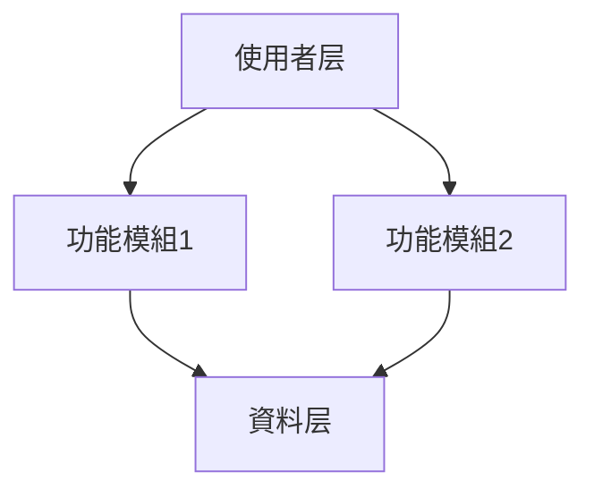
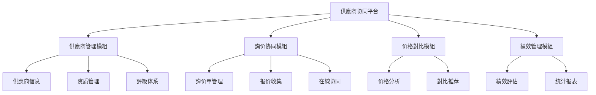
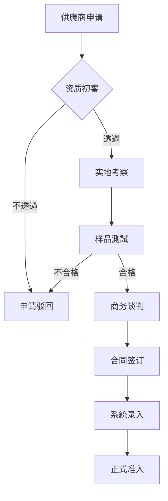

# 第二階段：產品規劃

## 階段目标

基於需求調研结果制定產品架構、功能模組和優先順序規劃，为PRD文件撰寫提供清晰的結構框架。

## 前置條件

- 已完成需求調研階段
- 存在 `.opencode/prd/{功能名}/research.md` 文件
- 需求調研報告已获得使用者认可

## 工作內容

### 1. 基於需求調研文件制定架構方案

- 分析需求調研中识别的核心問題
- 提炼產品功能的核心價值主张
- 規劃產品的整體架構和模組划分
- 設計功能模組之间的关系和依赖

### 2. 建立產品規劃文件

建立 `.opencode/prd/{功能名}/architecture.md`，包含以下內容：

#### 2.1 產品整體架構

**系統架構圖**：

- 使用Mermaid圖表展示產品架構
- 清晰标识各功能模組及其关系
- 说明資料流向和交互关系



**功能模組划分**：

- 按業務领域划分功能模組
- 说明每個模組的核心职责
- 定義模組边界和接口

**資料流向圖**：

- 展示關鍵業務資料的流轉路径
- 标识資料来源和目的地
- 说明資料转换和處理邏輯

#### 2.2 功能清單与優先順序

| 功能模組   | 核心功能             | 優先順序 | 複雜度 | 依赖关系   | 预估工作量 |
| ---------- | -------------------- | -------- | ------ | ---------- | ---------- |
| 供應商管理 | 信息管理、評級、審核 | P0       | 中     | 无         | 2周        |
| 詢价协同   | 在線詢价、报价收集   | P1       | 高     | 供應商管理 | 3周        |
| 价格對比   | 价格分析、优选推荐   | P1       | 中     | 詢价协同   | 1周        |
| 績效管理   | 評估统计、报表產生   | P2       | 中     | 供應商管理 | 2周        |

**優先順序说明**：

- **P0（核心功能）**：必須實作，是產品的基础功能
- **P1（重要功能）**：高優先順序，显著提升使用者價值
- **P2（增強功能）**：中等優先順序，锦上添花的功能
- **P3（扩展功能）**：低優先順序，未来可考虑的功能

**複雜度評估**：

- **低**：功能简單，實作直接
- **中**：功能适中，需要一定設計
- **高**：功能複雜，需要深入設計和多轮迭代

#### 2.3 使用者體驗設計

**核心流程**：

针對每個核心業務場景，設計使用者操作流程：

1. **供應商准入流程**

   ```mermaid
   graph TD
       A[供應商申请] --> B[资质審核]
       B -->|透過| C[实地考察]
       B -->|不透過| D[申请驳回]
       C --> E[样品測試]
       E -->|合格| F[商务谈判]
       E -->|不合格| D
       F --> G[合同签订]
       G --> H[系統录入]
       H --> I[正式准入]
   ```

2. **詢价协同流程**

   ```mermaid
   sequenceDiagram
       participant P as 採購专员
       participant S as 採購系統
       participant V1 as 供應商A
       participant V2 as 供應商B

       P->>S: 发起詢价申请
       S->>V1: 推送詢价單
       S->>V2: 推送詢价單
       V1->>S: 提交报价
       V2->>S: 提交报价
       S->>P: 价格對比分析
       P->>S: 選擇最优方案
   ```

**介面架構**：

- 頁面結構和导航設計
- 關鍵頁面的布局規劃
- 交互元素的組織方式

**交互原則**：

- 操作流程要简洁直观
- 關鍵操作要有明确反馈
- 异常情况要有友好提示
- 支援常用操作的快捷方式

### 3. 迭代计划

基於功能優先順序制定版本迭代计划：

| 版本 | 时间 | 核心功能                 | 業務價值                       |
| ---- | ---- | ------------------------ | ------------------------------ |
| V1.0 | 2周  | 供應商信息管理、評級体系 | 供應商信息统一化，評估標準化   |
| V1.1 | 3周  | 詢价协同、价格對比       | 採購效率提升30%，成本降低15%   |
| V1.2 | 2周  | 績效管理、统计报表       | 資料驱動决策，供應商管理精細化 |

## 輸出標準

### 文件結構

```markdown
# {功能名}產品規劃文件

## 1. 產品整體架構

### 1.1 系統架構圖

### 1.2 功能模組划分

### 1.3 資料流向圖

## 2. 功能清單与優先順序

### 2.1 功能列表

### 2.2 優先順序说明

### 2.3 複雜度評估

### 2.4 依赖关系分析

## 3. 使用者體驗設計

### 3.1 核心業務流程

### 3.2 介面架構

### 3.3 交互原則

## 4. 版本迭代计划

### 4.1 V1.0 MVP版本

### 4.2 V1.1 增強版本

### 4.3 V1.2 完善版本

## 5. 設計原則

### 5.1 模組化設計

### 5.2 可扩展性設計

### 5.3 使用者體驗优先

## 6. 集成方案

### 6.1 現有系統集成

### 6.2 第三方系統集成

### 6.3 資料同步方案
```

## 設計原則

### 模組化清晰

- 功能模組职责單一，边界清晰
- 模組间低耦合，高内聚
- 支援模組的独立開發和測試

### 可扩展性

- 预留扩展接口和钩子
- 支援功能的平滑升級
- 便于新功能的快速集成

### 使用者體驗优先

- 操作流程简洁高效
- 介面布局清晰合理
- 交互反馈及时准确
- 异常處理友好贴心

### 敏捷迭代

- 功能原子化，可独立交付
- 每個迭代都有明确的業務價值
- 支援快速反馈和調整
- 降低交付风險

## 品質檢查清單

- [ ] 產品架構是否清晰和完整
- [ ] 功能模組划分是否合理
- [ ] 優先順序排序是否准确
- [ ] 使用者體驗設計是否充分
- [ ] 迭代计划是否可行
- [ ] 是否考虑了可扩展性
- [ ] 是否符合敏捷開發原則
- [ ] 是否与需求調研结果一致

## 完成确认

當產品規劃文件建立完成后，我会：

1. 向您展示產品架構和功能規劃
2. 说明功能優先順序和迭代计划
3. 征求您對產品規劃的意见和建議
4. 确认產品規劃是否满足業務需求
5. 等待您的明确认可后进入下一階段

## 注意事項

- 產品規劃要基於需求調研的结果
- 要考虑現有系統的架構和約束
- 要平衡業務價值和實作複雜度
- 要符合敏捷開發的理念
- 要为后续PRD撰寫提供清晰框架

## 示例片段

### 產品整體架構示例



### 功能清單示例

| 功能模組   | 核心功能                       | 優先順序 | 複雜度 | 依赖关系   | 预估工作量 |
| ---------- | ------------------------------ | -------- | ------ | ---------- | ---------- |
| 供應商管理 | 信息管理、资质審核、評級体系   | P0       | 中     | 无         | 2周        |
| 詢价协同   | 詢价單管理、报价收集、在線协同 | P1       | 高     | 供應商管理 | 3周        |
| 价格對比   | 价格分析、對比推荐、歷史追溯   | P1       | 中     | 詢价协同   | 1周        |
| 績效管理   | 績效評估、统计分析、报表產生   | P2       | 中     | 供應商管理 | 2周        |

### 核心流程示例

**供應商准入流程**：



**流程说明**：

1. **供應商申请**：供應商提交基本信息和资质材料
2. **资质初審**：採購部门審核资质材料的完整性和有效性
3. **实地考察**：透過初審后安排实地考察，評估生产能力
4. **样品測試**：提供样品进行品質检测
5. **商务谈判**：样品合格后进行价格和合作条款谈判
6. **合同签订**：达成一致后签订供應合同
7. **系統录入**：将供應商信息录入系統
8. **正式准入**：供應商正式纳入合格供應商庫

## 推进到下一階段

當產品規劃完成并获得使用者认可后，使用以下方式自然推进：

"基於現有系統的功能增強架構已規劃完成。您觉得这個方案能有效提升供應鏈效率吗？如果认可，我可以开始按照標準PRD結構撰寫詳細需求文件"
