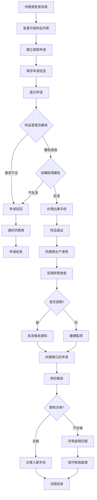
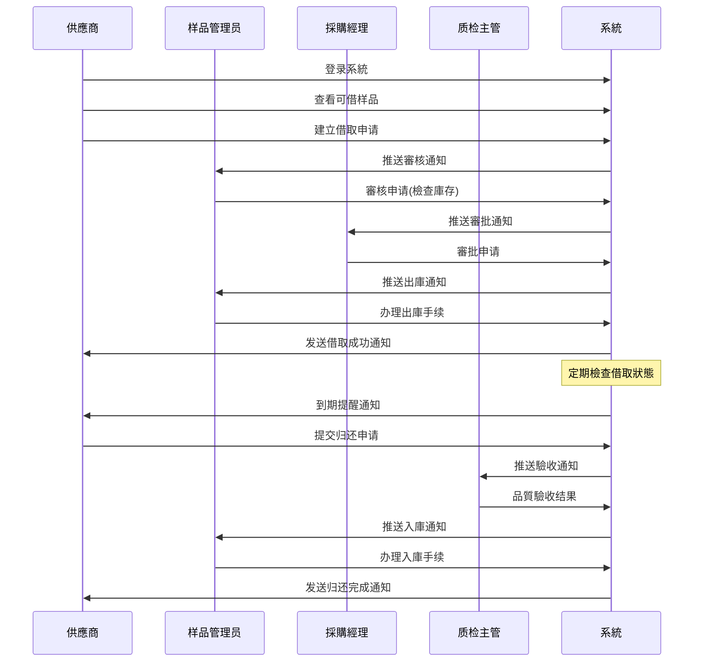
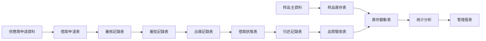
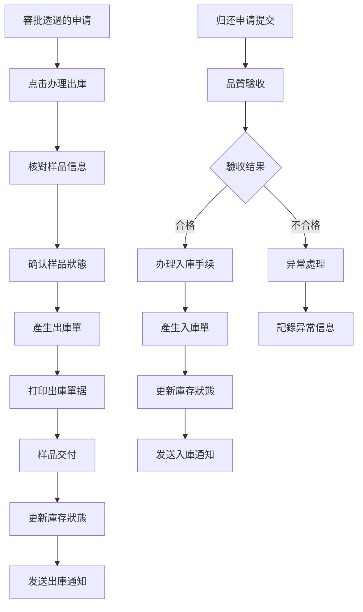
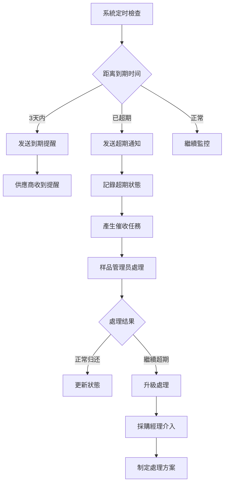
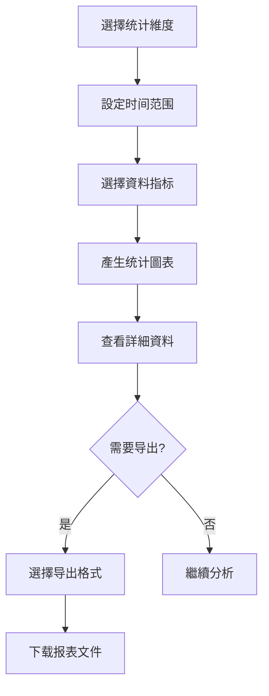
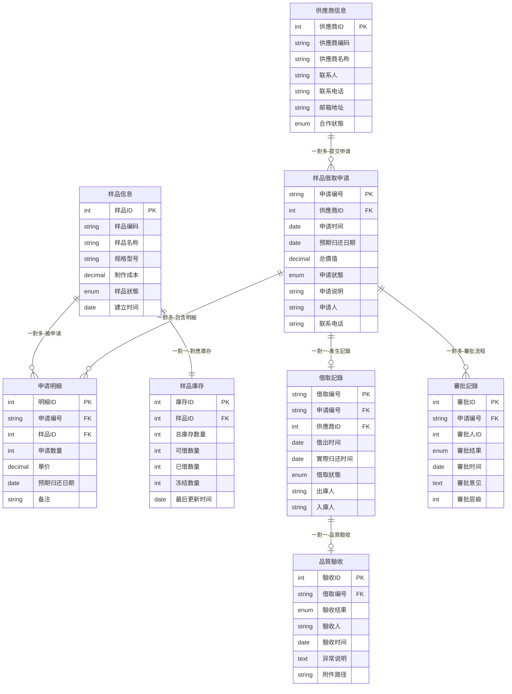

# 供應鏈系統PRD：供應商样品借取管理系統 V1.0

## 1. 版本迭代規劃
| 版本 | 时间 | 核心功能 | 業務價值 |
|------|------|----------|----------|
| V1.0 | 2周  | 样品借取申请、審批流程、基础出入庫 | 建立標準化借取流程，提升管理效率50% |
| V1.1 | 3周  | 品質驗收、超期提醒、基础报表 | 完善品質控制，降低样品损失率至1% |
| V1.2 | 4周  | 高級分析、移動端支援、批量操作 | 提升使用者體驗，支援移動办公 |

## 2. 業務背景与目标
### 2.1 項目背景
- 當前供應商样品管理缺乏系統化支援，借取記錄分散在Excel表格中，查詢困难
- 样品借取流程不規範，缺乏標準化的審批和归还机制，导致样品丢失率高达5%
- 无法实时跟踪样品狀態，影響生产计划安排和成本控制
- 業務量增长30%，現有人工管理模式已无法满足效率要求，急需数字化升級

### 2.2 核心使用者与場景
| 角色 | 职责 | 使用場景 | 關鍵痛点 |
|------|------|----------|----------|
| 供應商 | 样品借取申请、按时归还 | 新订單生产前借取參考样品 | 申请流程繁琐，不瞭解庫存狀態 |
| 样品管理员 | 样品庫存管理、借取審核 | 日常样品出入庫管理、狀態跟踪 | 手工記錄工作量大，难以跟踪超期 |
| 採購經理 | 样品借取政策制定、重要申请審批 | 高價值样品審批、供應商績效評估 | 缺乏全面資料分析，决策依据不足 |
| 质检主管 | 样品品質標準制定、归还驗收 | 制定品質要求、驗收归还样品 | 品質標準不统一，缺乏系統記錄 |

### 2.3 業務目标
- **效率提升目标**：样品借取申请處理时间從24小时缩短至4小时，查詢效率提升80%
- **成本控制目标**：样品丢失率從5%降低至1%以内，超期归还率控制在5%以下
- **品質改善目标**：建立標準化品質驗收流程，归还合格率达95%以上
- **管理規範目标**：實作100%电子化管理，建立完整的样品生命周期追溯体系

## 3. 業務名词
| 業務名词 | 名词说明 | 應用場景 |
|----------|----------|----------|
| 样品借取申请 | 供應商向企业申请借用样品进行生产參考的正式申请單据 | 申请建立、審核審批 |
| 可借庫存 | 样品实物庫存中可供外借的数量，扣除已借出和冻结部分 | 庫存查詢、申请校验 |
| 借取期限 | 样品允许借用的最长时间，預設30天，最长不超过60天 | 申请審批、超期監控 |
| 品質驗收 | 样品归还时對其完好性、清洁度等品質状况的檢查确认 | 归还處理、异常記錄 |
| 超期样品 | 超过约定归还期限仍未归还的样品 | 催收提醒、异常處理 |
| 样品冻结 | 因品質問題或争議暂时不可借出的样品狀態 | 庫存管理、品質控制 |
| 借取额度 | 單個供應商同时可借用样品的最大数量限制 | 申请校验、风險控制 |
| 样品成本 | 样品的制作成本，用于损坏赔偿和價值評估 | 審批依据、损失核算 |

## 4. 流程圖
### 4.1 業務流程圖

**流程说明**：
1. **申请階段**：供應商在系統中選擇样品，填写借取申请，说明用途和归还期限
2. **審核階段**：样品管理员驗證庫存充足性，採購經理根据價值和政策进行審批
3. **借用階段**：審批透過后办理出庫，样品交付供應商使用
4. **監控階段**：系統自動跟踪借取狀態，超期自動发送催收通知
5. **归还階段**：供應商提交归还申请，质检驗收后办理入庫手续
6. **异常處理**：處理样品损坏、丢失等异常情况，記錄责任和损失

### 4.2 系統流程圖

### 4.3 資料流程圖

## 5. 功能需求详述与介面設計
### 5.1 样品借取申请管理
**功能概述**：提供供應商样品借取申请的建立、提交、修改和撤销功能，支援多样品批量申请

**使用者故事**：作为供應商，我希望能够快速查看可借样品并提交借取申请，以便高效獲取生产參考样品

**頁面布局**：

> 📋 **提示**：粘贴样品借取申请頁面原型圖

**介面及交互说明**：

##### 5.1.1 頁面说明
供應商登录系統后，点击一級菜單"样品管理" --- 二級菜單"借取申请" --- 三級菜單"新建申请"进入该頁面

##### 5.1.2 基本信息区
| 欄位名称 | 組件 | 提示文本 | 欄位说明 |
|----------|------|----------|----------|
| 供應商名称 | 文本顯示 | - | 1. 根据登录使用者自動顯示 2. 不可編輯，灰色顯示 |
| 联系人 | 文本顯示 | - | 1. 顯示主联系人姓名 2. 從供應商信息自動獲取 |
| 联系电话 | 文本顯示 | - | 1. 顯示主联系人手机号 2. 格式：138****8888 |
| 申请时间 | 文本顯示 | - | 1. 系統當前时间 2. 格式：2024-01-15 14:30 |

##### 5.1.3 样品選擇区
| 欄位名称 | 組件 | 提示文本 | 欄位说明 |
|----------|------|----------|----------|
| 样品搜索 | 搜索框 | 请輸入样品名称或编码 | 1. 支援模糊搜索 2. 輸入2字符后顯示候选項 |
| 样品名称 | 下拉選擇 | 请選擇样品 | 1. 顯示可借样品列表 2. 顯示格式：样品名称(可借数量) |
| 申请数量 | 数字輸入 | 请輸入数量 | 1. 必須大于0的整数 2. 不能超过可借数量 |
| 预期归还日期 | 日期選擇 | 请選擇日期 | 1. 預設30天后 2. 最长不超过60天 |

##### 5.1.4 样品列表明細说明
| 欄位名称 | 欄位说明 |
|----------|----------|
| 样品编码 | 系統自動產生的唯一标识，格式：SP+8位数字 |
| 样品名称 | 样品完整名称，包含规格信息 |
| 當前庫存 | 样品实物庫存总数 |
| 可借数量 | 扣除已借出和冻结后的可借用数量 |
| 申请数量 | 本次申请借取的数量 |
| 样品成本 | 單個样品的制作成本，用于风險評估 |
| 预期归还 | 本批次样品的预期归还日期 |

##### 5.1.5 操作说明
| 操作項 | 说明 |
|--------|------|
| 添加样品 | 1. 使用者点击【添加样品】按钮，弹出样品選擇對话框 2. 可多选样品，批量添加到申请列表 3. 自動校验庫存数量，不足时给出提示 |
| 删除样品 | 1. 使用者点击样品行的【删除】按钮 2. 确认删除后從申请列表中移除 3. 至少保留一個样品才能提交申请 |
| 修改数量 | 1. 直接在申请数量列輸入框中修改 2. 实时校验不能超过可借数量 3. 修改后自動計算总價值 |
| 保存草稿 | 1. 使用者点击【保存草稿】按钮，保存當前申请信息 2. 狀態为"草稿"，可繼續編輯 3. 草稿7天后自動清理 |
| 提交申请 | 1. 使用者点击【提交申请】按钮，提交正式申请 2. 提交前校验必填欄位和業務規則 3. 提交后狀態變为"待審核"，不可修改 |

**業務規則**：
- **数量限制規則**：單次申请数量不超过可借庫存，同一供應商总借取数量不超过設定额度
- **期限控制規則**：借取期限預設30天，最长不超过60天，超期自動发送提醒
- **審批規則**：总價值500元以下样品管理员審核即可，500元以上需採購經理審批
- **狀態流轉規則**：草稿→待審核→審核中→已批准→已驳回，每個狀態有對應的操作權限

**驗收標準**：
| 驗收項目 | 驗收標準 | 測試方法 |
|----------|----------|----------|
| 申请建立 | 3分钟内完成單個样品申请，5分钟内完成多样品申请 | 功能測試 |
| 資料校验 | 实时校验庫存数量、借取额度等業務規則 | 边界值測試 |
| 使用者體驗 | 操作流程不超过5步，错误提示清晰明确 | 可用性測試 |

### 5.2 審核審批管理
**功能概述**：为样品管理员和採購經理提供借取申请的審核審批功能，支援批量處理和審批歷史查詢

**使用者故事**：作为样品管理员，我希望能够快速審核借取申请并檢查庫存狀態，以便及时處理供應商需求

**頁面布局**：

> 📋 **提示**：粘贴審核管理頁面原型圖

**介面及交互说明**：

##### 5.2.1 頁面说明
样品管理员登录系統后，点击一級菜單"样品管理" --- 二級菜單"審核管理" --- 进入審核待办頁面

##### 5.2.2 筛选查詢区
| 欄位名称 | 組件 | 提示文本 | 欄位说明 |
|----------|------|----------|----------|
| 申请狀態 | 下拉列表 | 请選擇 | 1. 选項：全部、待審核、審核中、已批准、已驳回 2. 預設顯示：待審核 |
| 申请日期 | 日期范围 | 请選擇日期范围 | 1. 支援快捷選擇：今天、本周、本月 2. 預設顯示最近7天 |
| 供應商名称 | 搜索框 | 请輸入供應商名称 | 1. 支援模糊搜索 2. 下拉顯示匹配结果 |
| 申请编号 | 輸入框 | 请輸入申请编号 | 1. 支援精确匹配 2. 格式：BT+年月日+流水号 |

##### 5.2.3 列表明細说明
| 欄位名称 | 欄位说明 |
|----------|----------|
| 申请编号 | 系統自動產生，格式：BT+YYYYMMDD+001 |
| 供應商名称 | 申请供應商的完整企业名称 |
| 申请人 | 提交申请的联系人姓名 |
| 申请时间 | 申请提交的具體时间，精确到分钟 |
| 样品数量 | 申请样品的种类数和总件数，格式：3种/5件 |
| 总價值 | 申请样品的总制作成本，用于審批參考 |
| 预期归还 | 申请中填写的预期归还日期 |
| 當前狀態 | 申请的當前處理狀態，用颜色标识 |
| 庫存狀態 | 顯示庫存是否充足，✓充足 ⚠️紧张 ✗不足 |

##### 5.2.4 操作说明
| 操作項 | 说明 |
|--------|------|
| 查看详情 | 1. 使用者点击【查看详情】按钮，弹出申请详情頁面 2. 顯示完整的申请信息、样品明細、申请说明 3. 顯示庫存狀態和歷史借取記錄 |
| 審核透過 | 1. 样品管理员点击【審核透過】按钮 2. 系統校验庫存充足性和業務規則 3. 透過后狀態變为"審核中"，推送给採購經理審批 |
| 審核驳回 | 1. 样品管理员点击【驳回】按钮，弹出驳回原因輸入框 2. 必須填写驳回原因，如庫存不足、申请不合理等 3. 驳回后狀態變为"已驳回"，通知供應商 |
| 批量審核 | 1. 使用者勾选多個申请，点击【批量審核】按钮 2. 支援批量透過或批量驳回 3. 系統逐一校验，失败的给出具體原因 |
| 審批透過 | 1. 採購經理点击【審批透過】按钮 2. 高價值样品需要填写審批意见 3. 透過后狀態變为"已批准"，可办理出庫 |
| 審批驳回 | 1. 採購經理点击【驳回】按钮，填写驳回理由 2. 驳回后退回到样品管理员，可重新審核 3. 系統記錄完整的審批流程 |

**業務規則**：
- **權限控制規則**：样品管理员只能審核，採購經理可審批，不能越权操作
- **庫存檢查規則**：審核时实时檢查庫存狀態，庫存不足自動驳回
- **时效性規則**：申请超过3個工作日未處理，系統自動催办
- **審批层級規則**：根据样品总價值自動確定審批层級和審批人

**驗收標準**：
| 驗收項目 | 驗收標準 | 測試方法 |
|----------|----------|----------|
| 審核效率 | 單個申请審核时间不超过2分钟 | 效率測試 |
| 批量處理 | 支援最多20個申请的批量審核 | 压力測試 |
| 審批准确性 | 審批規則執行正确率100% | 規則測試 |

### 5.3 样品出入庫管理
**功能概述**：提供样品的出庫、入庫操作管理，实时更新庫存狀態，產生出入庫單据

**使用者故事**：作为样品管理员，我希望能够快速办理样品出入庫手续，確保庫存資料准确无误

**交互流程**：

**業務規則**：
- **出庫規則**：只有審批透過的申请才能办理出庫，出庫时必須核對样品实物
- **入庫規則**：归还样品必須经过品質驗收，合格后才能入庫
- **庫存更新規則**：出入庫操作立即更新庫存資料，確保資料实时性
- **單据管理規則**：每次出入庫都產生正式單据，支援打印和电子存档

### 5.4 超期提醒与异常處理
**功能概述**：自動監控样品借取狀態，提供超期预警、催收通知和异常情况處理

**使用者故事**：作为样品管理员，我希望系統能够自動提醒超期样品，幫助我及时催收

**交互流程**：

**業務規則**：
- **提醒机制**：到期前3天、1天各提醒一次，超期后每3天提醒一次
- **升級机制**：超期7天自動升級，採購經理介入處理
- **责任追究**：超期30天启動赔偿程序，記錄供應商信用
- **异常記錄**：所有异常情况都要詳細記錄，形成處理档案

### 5.5 统计分析报表
**功能概述**：提供样品借取的多維度统计分析，支援报表导出和資料可视化

**使用者故事**：作为採購經理，我希望能够查看样品借取的统计分析，以便制定更好的管理策略

**交互流程**：

**功能特點**：
- **多維度分析**：按供應商、样品類型、时间等維度统计
- **可视化圖表**：柱状圖、饼圖、趋势圖等多种展示方式
- **实时資料**：统计資料实时更新，確保分析准确性
- **报表导出**：支援Excel、PDF等格式导出

## 6. 資料模型
### 6.1 核心實體定義
| 實體名称 | 業務含义 | 核心属性 | 資料類型 | 業務約束 |
|----------|----------|----------|----------|----------|
| 样品借取申请 | 供應商提交的样品借取申请單 | 申请编号、供應商ID、申请狀態、总價值 | VARCHAR、INT、ENUM、DECIMAL | 申请编号唯一，狀態流轉有序 |
| 申请明細 | 申请中的具體样品信息 | 样品ID、申请数量、预期归还日期 | INT、INT、DATE | 数量必須大于0 |
| 样品庫存 | 样品的庫存信息 | 样品编码、总庫存、可借庫存、冻结庫存 | VARCHAR、INT、INT、INT | 庫存数量不能为负 |
| 借取記錄 | 样品的借出归还記錄 | 借取编号、借出时间、归还时间、狀態 | VARCHAR、DATETIME、DATETIME、ENUM | 借出时间必須早于归还时间 |
| 品質驗收 | 样品归还时的品質檢查記錄 | 驗收结果、驗收人、驗收时间、异常说明 | ENUM、VARCHAR、DATETIME、TEXT | 驗收人不能为空 |

### 6.2 實體关系圖

**关系说明**：
- **样品借取申请 → 申请明細**：一對多关系，一個申请可包含多個样品明細
- **样品信息 → 样品庫存**：一對一关系，每個样品有唯一對應的庫存記錄
- **样品借取申请 → 借取記錄**：一對一关系，審批透過后產生借取記錄
- **借取記錄 → 品質驗收**：一對一关系，归还时必須进行品質驗收
- **供應商信息 → 样品借取申请**：一對多关系，一個供應商可有多個申请
- **样品借取申请 → 審批記錄**：一對多关系，支援多級審批流程

### 6.3 關鍵欄位说明

#### 申请狀態枚举
- **草稿(DRAFT)**：使用者保存但未提交的申请
- **待審核(PENDING_REVIEW)**：已提交等待样品管理员審核
- **審核中(REVIEWING)**：審核透過等待採購經理審批
- **已批准(APPROVED)**：審批透過可办理出庫
- **已驳回(REJECTED)**：審核或審批不透過
- **已完成(COMPLETED)**：样品已归还，流程结束

#### 借取狀態枚举
- **已借出(BORROWED)**：样品已出庫给供應商
- **即将到期(EXPIRING)**：距离归还期限3天内
- **已超期(OVERDUE)**：超过预定归还期限
- **已归还(RETURNED)**：样品已归还并驗收
- **异常(EXCEPTION)**：样品丢失、损坏等异常情况

## 7. 驗收標準
| 功能模組 | 驗收場景 | 驗收標準 | 測試資料 |
|----------|----------|----------|----------|
| 样品借取申请 | 建立新申请 | 3分钟内完成申请建立，信息保存准确 | 5個不同样品的混合申请 |
| 審核審批流程 | 多級審批 | 審批流程按規則執行，通知及时到达 | 不同價值区间的申请 |
| 出入庫管理 | 样品出庫 | 庫存实时更新，單据產生正确 | 10件样品的出庫操作 |
| 超期提醒 | 自動提醒 | 到期前3天、1天准时提醒，超期立即通知 | 設定測試到期日期 |
| 统计分析 | 資料报表 | 统计資料准确，圖表顯示正确，导出成功 | 一個月的完整業務資料 |
| 异常處理 | 样品损坏 | 异常流程完整，责任記錄清晰，處理及时 | 模拟样品损坏情况 |
| 系統性能 | 并发操作 | 支援50個使用者同时操作，回應时间<3秒 | 并发測試工具驗證 |
| 資料安全 | 權限控制 | 不同角色權限正确，敏感操作有審计日誌 | 多角色權限測試 |

---

**PRD總結**：
本PRD詳細定義了供應商样品借取管理系統的完整功能需求，包括4個核心使用者角色、6大功能模組、完整的業務流程和資料模型。系統将显著提升样品管理效率，降低丢失率，建立標準化的样品生命周期管理体系。

**核心價值**：
- 管理效率提升50%以上
- 样品丢失率控制在1%以内
- 建立完整的追溯体系
- 實作100%电子化管理
