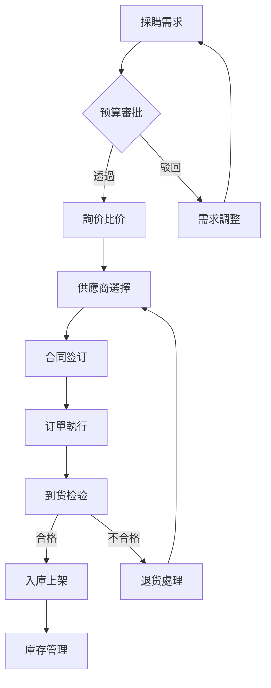
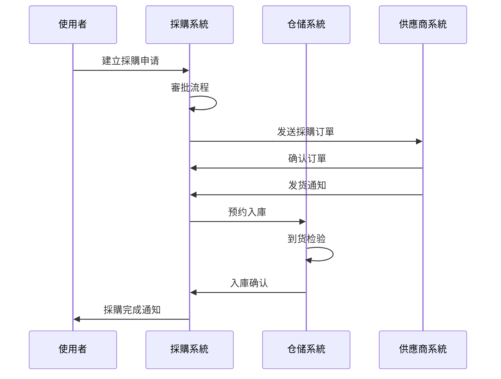
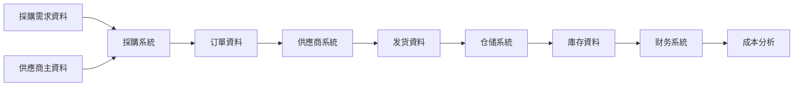
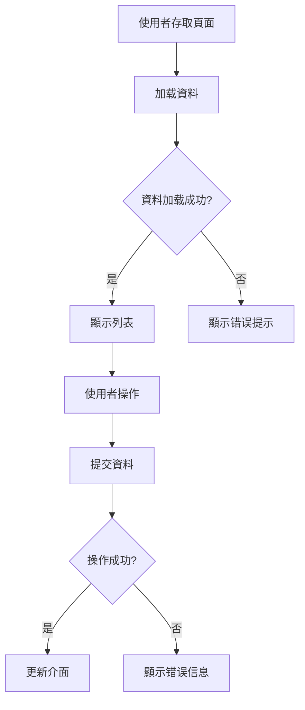
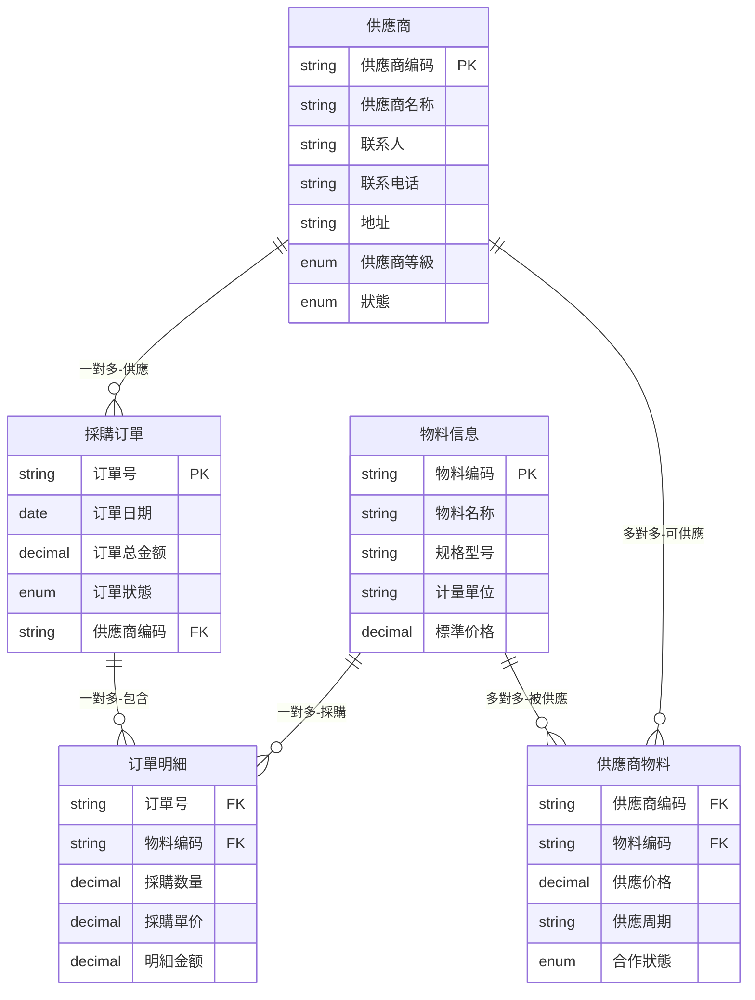

# B端供應鏈PRD模板

本文件提供標準的B端供應鏈產品需求文件模板，確保PRD文件的結構完整、內容規範。

## 模板使用說明

本模板適用於B端供應鏈管理系統的產品需求文件撰寫，包括採購、庫存、物流、供應商管理等核心業務場景。

### 使用原則

1. **完整性**：按照模板結構完整填写各章節內容
2. **准确性**：使用供應鏈專業术语，描述准确无歧义
3. **可執行性**：確保開發、設計、測試团队能理解和執行
4. **業務导向**：专注業務價值和使用者體驗，不涉及技術實作細節

---

# 供應鏈系統PRD：[系統名称]-[功能模組] V1.0

## 1. 版本迭代規劃

| 版本 | 时间 | 核心功能 | 業務價值 |
|------|------|----------|----------|
| V1.0 | 2周  | [功能1]  | [價值1]  |
| V1.1 | 3周  | [功能2]  | [價值2]  |
| V1.2 | 2周  | [功能3]  | [價值3]  |

**说明**：
- 版本号采用语义化版本控制
- 时间为预估工作量，包括開發、測試、上線
- 核心功能應具體明确
- 業務價值應可量化

---

## 2. 業務背景与目标

### 2.1 項目背景

- 當前供應鏈管理面临的核心挑戰
- 行業发展趋势和竞争環境分析
- 業務发展瓶颈和亟需解决的問題
- 項目启動的關鍵驱動因素

**示例**：
- 當前供應商信息分散在各個Excel表格中，查詢困难，信息更新不及时
- 採購詢价主要透過邮件和电话，效率低下，价格對比複雜
- 缺乏统一的供應商評估標準，品質管控存在风險
- 業務量增长30%，現有人工流程已无法满足效率要求

### 2.2 核心使用者与場景

| 角色 | 职责 | 使用場景 | 關鍵痛点 |
|------|------|----------|----------|
| 採購专员 | 供應商管理、订單執行 | 供應商評估、採購下單 | 供應商信息分散、詢价效率低 |
| 仓储主管 | 庫存管理、收发货 | 入庫驗收、庫存盘点 | 庫存資料不准确、盘点繁琐 |
| 物流专员 | 運輸协调、物流跟踪 | 運輸安排、貨物跟踪 | 物流信息滞后、异常處理难 |
| 财务专员 | 對账結算、成本核算 | 採購對账、费用結算 | 對账效率低、資料不准确 |
| 供應商 | 订單接收、发货管理 | 订單确认、发货通知 | 信息不透明、沟通成本高 |

### 2.3 業務目标

- **效率提升目标**：採購周期缩短30%、庫存周转率提升25%
- **成本控制目标**：採購成本降低15%、庫存成本减少20%
- **品質改善目标**：供應商合规率达95%、庫存准确率达99%
- **协同優化目标**：供應鏈回應速度提升40%、异常處理时间减少50%

**说明**：
- 目标應具體可衡量
- 需要明确基准值和目标值
- 包含时间維度

---

## 3. 業務名词

| 業務名词 | 名词说明 | 應用場景 |
|----------|----------|----------|
| 採購订單 | 採購部门向供應商发出的正式採購凭证 | 物料採購、服务採購 |
| 供應商評級 | 基於品質、交期、价格、服务等維度的供應商综合評分 | 供應商准入、績效考核 |
| 庫存周转率 | 一定时期内庫存物料的周转次数，反映庫存管理效率 | 庫存優化、成本控制 |
| 安全庫存 | 为防止缺货而保持的最低庫存量 | 庫存计划、风險控制 |
| 到货检验 | 對供應商交付物料的品質、数量、规格进行确认 | 入庫管理、品質控制 |
| 物流單据 | 包含运單、配送單、签收單等物流相关凭证 | 物流跟踪、對账結算 |
| ABC分类 | 按價值重要性将物料分为A、B、C三类的管理方法 | 庫存分类、採購策略 |
| 供應鏈协同 | 供應鏈各環節间的信息共享和業務協作 | 订單协同、庫存协同 |

**说明**：
- 包含所有關鍵業務术语
- 提供准确的定義和應用場景
- 保持术语使用的一致性

---

## 4. 流程圖

### 4.1 業務流程圖

**流程说明**：

1. **需求发起**：業務部门提交採購需求，包含物料规格、数量、交期等信息
2. **预算審批**：财务部门審核预算额度，确认採購资金来源
3. **供應商選擇**：透過詢价比价選擇最优供應商，考虑价格、品質、交期等因素
4. **订單執行**：签订採購合同，跟踪订單執行进度
5. **品質控制**：到货后进行品質检验，確保符合要求
6. **庫存管理**：合格物料入庫，进入庫存管理体系

### 4.2 系統流程圖

**系統流程说明**：

1. **採購申请**：使用者在系統中录入採購需求，自動路由至相关審批人
2. **订單下达**：審批透過后系統自動產生採購订單，推送给供應商
3. **协同跟踪**：供應商系統接收订單并反馈執行狀態
4. **庫存集成**：与仓储系統集成，實作從採購到入庫的全程跟踪

### 4.3 資料流程圖

**資料流向说明**：

1. **主資料管理**：统一维护供應商、物料、价格等主資料
2. **交易資料流轉**：採購订單、发货單、入庫單等業務資料在各系統间流轉
3. **資料分析應用**：基於業務資料进行成本分析、績效評估等

---

## 5. 功能需求详述与介面設計

### 5.1 [功能模組名]

**功能概述**：[功能的整體描述和業務價值]

**使用者故事**：作为[角色]，我希望[功能]，以便于[價值]

**頁面布局**：

圖片位置：`./images/頁面原型.png`
> 📋 **提示**：粘贴頁面原型圖

**介面及交互说明**：

#### 5.1.1 頁面说明

使用者登录系統BU - 供應商平台，点击一級菜單供應商管理 --- 二級菜單供應商列表 --- 三級菜單进入该列表頁

#### 5.1.2 筛选查詢区

| 欄位名称 | 組件 | 提示文本 | 欄位说明 |
|----------|------|----------|----------|
| 供應商名称 | 輸入框 | 请輸入 | 1. 支援模糊查詢 2. 最少輸入2個字符 |
| 供應商類型 | 下拉列表 | 请選擇 | 1. 資料源：供應商類型字典 2. 支援全部/多选 |
| 合作狀態 | 下拉列表 | 请選擇 | 1. 資料值：合作中、暂停、終止 2. 預設：全部 |
| 建立时间 | 日期范围 | 请選擇 | 1. 支援快捷选項：今天、本周、本月 2. 支援自定義日期范围 |

#### 5.1.3 列表欄位说明

| 欄位名称 | 欄位说明 |
|----------|----------|
| 供應商编码 | 系統自動產生，格式：SUP + 8位流水号 |
| 供應商名称 | 供應商全称，必填，最多100字符 |
| 联系人 | 主要联系人姓名，必填 |
| 联系电话 | 联系人手机号，必填，格式校验 |
| 供應商評級 | A/B/C/D四個等級，系統自動計算 |
| 合作狀態 | 合作中、暂停、終止 |
| 建立时间 | 供應商建立的时间 |

#### 5.1.4 列表操作说明

| 操作項 | 说明 |
|--------|------|
| 新增 | 1. 点击【新增】按钮 2. 弹出新增表單 3. 填写必填項后提交 4. 校验透過后保存，狀態为待審核 |
| 編輯 | 1. 点击列表行的【編輯】按钮 2. 弹出編輯表單，回显當前資料 3. 修改后提交，重新进入審核流程 |
| 删除 | 1. 点击【删除】按钮 2. 弹出确认提示 3. 确认后邏輯删除（软删除） |
| 查看详情 | 1. 点击供應商名称或【详情】按钮 2. 跳转到详情頁，顯示完整信息 |
| 导出 | 1. 点击【导出】按钮 2. 导出當前筛选條件下的資料 3. 格式：Excel，欄位同列表 |

**業務規則**：

- **資料驗證規則**
  - 供應商编码：系統自動產生，全域唯一
  - 供應商名称：必填，长度2-100字符，不可重复
  - 联系电话：必填，手机号格式校验
  - 邮箱地址：选填，邮箱格式校验

- **權限控制規則**
  - 普通使用者：只能查看自己負責的供應商
  - 採購专员：可新增、編輯、查看
  - 採購主管：可審核、删除、导出
  - 系統管理员：拥有全部權限

- **狀態流轉規則**
  - 新建 → 待審核：提交新增表單后
  - 待審核 → 審核透過：主管審核透過
  - 待審核 → 審核驳回：主管審核不透過
  - 審核透過 → 合作中：签订合同后
  - 合作中 → 暂停：出现品質問題或其他原因
  - 暂停 → 合作中：問題解决后恢复
  - 合作中/暂停 → 終止：終止合作关系

- **异常處理規則**
  - 网络异常：顯示离線缓存資料，提示网络异常
  - 資料加载失败：顯示错误提示，提供重试按钮
  - 操作失败：顯示具體错误信息，不关闭表單
  - 并发冲突：提示資料已被他人修改，刷新后重试

**驗收標準**：

| 驗收項目 | 驗收標準 | 測試方法 |
|----------|----------|----------|
| 功能完整性 | 所有使用者故事場景正常執行 | 手工測試+自動化測試 |
| 性能要求 | 頁面加载时间<2秒，操作回應<1秒 | 性能測試工具驗證 |
| 兼容性 | 支援Chrome、Firefox、Safari主流浏覽器 | 跨浏覽器兼容性測試 |
| 資料准确性 | 資料保存、查詢、统计100%准确 | 資料對比驗證 |
| 安全性 | 透過SQL注入、XSS攻击等安全測試 | 安全測試工具扫描 |

### 5.2 [另一功能模組名]

**功能概述**：[功能描述]

**交互流程**：

**交互说明**：詳細描述使用者在此頁面的操作流程和系統回應

---

## 6. 資料模型

### 6.1 核心實體定義

| 實體名称 | 業務含义 | 核心属性 | 資料類型 | 業務約束 |
|----------|----------|----------|----------|----------|
| 供應商 | 提供物料或服务的外部組織 | 编码、名称、联系人、地址 | VARCHAR、TEXT | 编码唯一，名称必填 |
| 採購订單 | 向供應商採購的正式凭证 | 订單号、日期、金额、狀態 | VARCHAR、DATE、DECIMAL | 订單号自動產生 |
| 物料信息 | 採購的商品或原材料信息 | 编码、名称、规格、單位 | VARCHAR、TEXT | 编码全域唯一 |
| 订單明細 | 採購订單的明細行項目 | 订單号、物料、数量、單价 | VARCHAR、DECIMAL | 明細金额自動計算 |
| 供應商物料 | 供應商可供應的物料关系 | 供應商、物料、价格、周期 | VARCHAR、DECIMAL | 供應价格必填 |

**说明**：
- 實體名称：使用業務术语命名
- 業務含义：准确描述實體的業務意义
- 核心属性：列出關鍵欄位
- 資料類型：仅说明大致類型，不涉及具體資料庫實作
- 業務約束：说明業務規則和約束條件

### 6.2 實體关系圖

**关系類型符号说明**：
- `||--o{` : 一對多关系（1:N）
- `}o--o{` : 多對多关系（M:N）
- `||--||` : 一對一关系（1:1）
- `||--o|` : 一對零或一关系（1:0..1）

**关系说明**：
- **供應商 → 採購订單**：一對多关系，一個供應商可以有多個採購订單
- **採購订單 → 订單明細**：一對多关系，一個订單包含多個明細行
- **物料信息 → 订單明細**：一對多关系，一种物料可以出现在多個订單中
- **供應商 ↔ 物料信息**：多對多关系，透過供應商物料表關聯，記錄供應关系和价格信息

---

## 7. 驗收標準

| 功能模組 | 驗收場景 | 驗收標準 | 測試資料 |
|----------|----------|----------|----------|
| 供應商管理 | 新增供應商 | 信息保存成功，狀態为待審核 | 完整供應商信息 |
| 供應商管理 | 編輯供應商 | 信息更新成功，重新进入審核 | 修改部分欄位 |
| 供應商管理 | 删除供應商 | 邏輯删除成功，列表不再顯示 | 已有供應商記錄 |
| 採購下單 | 建立採購订單 | 订單產生，推送供應商 | 標準採購申请 |
| 採購下單 | 订單審批 | 審批流程正常，狀態正确流轉 | 待審批订單 |
| 庫存入庫 | 物料入庫操作 | 庫存数量准确更新 | 入庫單据資料 |
| 庫存入庫 | 品質检验 | 不合格物料正确處理 | 质检不合格資料 |

**说明**：
- 功能模組：對應第5章的功能模組
- 驗收場景：具體的測試場景
- 驗收標準：明确的驗收透過標準
- 測試資料：需要准备的測試資料

---

## 附录：填写指南

### 必填章節

1. 版本迭代規劃
2. 業務背景与目标
3. 業務名词
4. 流程圖
5. 功能需求详述与介面設計
6. 資料模型
7. 驗收標準

### 可选章節

根据實際情况可添加：
- 技術約束
- 上線计划
- 风險評估
- 培训计划

### 圖片使用規範

- 使用占位符标识圖片位置
- 提供清晰的插入提示
- 统一使用./images/目錄
- 圖片文件命名清晰明确

### 格式規範

- 使用Markdown格式
- 表格內容對齐
- Mermaid圖表语法正确
- 標題层級清晰

### 注意事項

1. **专注業務层面**：PRD描述業務需求，不涉及技術實作細節
2. **供應鏈專業性**：使用供應鏈行業標準术语
3. **現有系統增強**：預設基於現有系統功能增強
4. **敏捷迭代**：支援功能的原子化和渐进式交付
5. **可執行性**：確保開發、設計、測試团队能理解和執行

### 參考文件

- [供應鏈業務术语表](./SUPPLY_CHAIN_TERMS.md)
- [PRD評審標準](./REVIEW_CRITERIA.md)
- [完整PRD示例](./PRD_EXAMPLES.md)

---

**版本記錄**：
- V1.0 (2025-10-24): 初始版本，完整PRD模板
