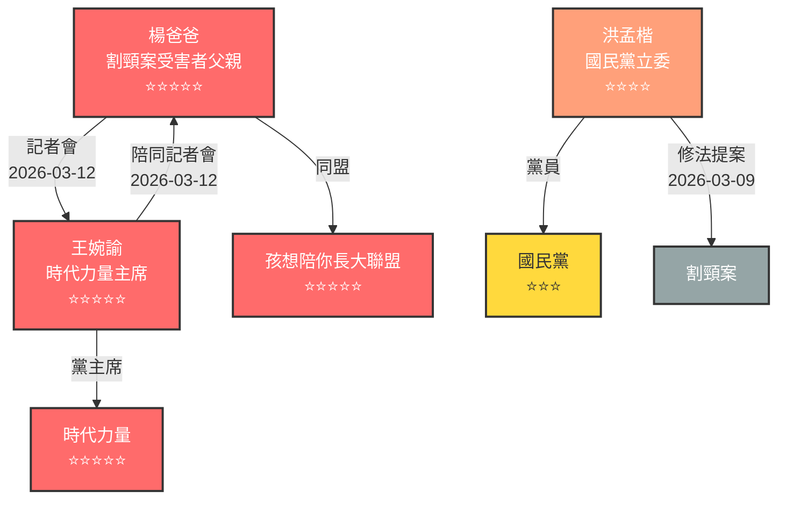

# Graph Database 更新報告 - 2026-03-16

## 更新摘要

✅ **成功更新 Graph Database**，根據最新新聞報導提取並建立了以下實體與關係。

---

## 📊 更新統計

| 項目 | 數量 | 說明 |
|------|------|------|
| **新增節點** | 7 | 人物、組織、政黨、案件 |
| **新增關係** | 6 | 互動、同盟、上下級 |
| **立場評分** | 5 | 0-5 星級評分 |

---

## 👥 新增實體

### 人物 (3)

| ID | 姓名 | 角色 | 政黨 | 立場 | 評分 |
|----|------|------|------|------|------|
| `yang_dad` | 楊爸爸 | 割頸案受害者父親 | - | ⭐⭐⭐⭐⭐ | 5 |
| `wang_wanyu` | 王婉諭 | 時代力量主席 | 時代力量 | ⭐⭐⭐⭐⭐ | 5 |
| `hung_meng_kai` | 洪孟楷 | 國民黨立委 | 國民黨 | ⭐⭐⭐⭐ | 4 |

### 組織 (1)

| ID | 名稱 | 類型 | 立場 | 評分 |
|----|------|------|------|------|
| `child_growth_alliance` | 孩想陪你長大聯盟 | organization | ⭐⭐⭐⭐⭐ | 5 |

### 政黨 (2)

| ID | 名稱 | 立場 | 評分 |
|----|------|------|------|
| `npp` | 時代力量 | ⭐⭐⭐⭐⭐ | 5 |
| `kmt` | 國民黨 | ⭐⭐⭐ | 3 |

### 案件 (1)

| ID | 名稱 | 類型 |
|----|------|------|
| `cutting_neck_case` | 割頸案 | case |

---

## 🔗 新增關係

### 互動關係 (3)

| 來源 | 目標 | 類型 | 互動內容 | 日期 |
|------|------|------|---------|------|
| 楊爸爸 | 王婉諭 | interact | 記者會 | 2026-03-12 |
| 王婉諭 | 楊爸爸 | interact | 陪同記者會 | 2026-03-12 |
| 洪孟楷 | 割頸案 | interact | 修法提案 | 2026-03-09 |

### 同盟關係 (1)

| 來源 | 目標 | 類型 |
|------|------|------|
| 楊爸爸 | 孩想陪你長大聯盟 | ally |

### 上下級關係 (2)

| 來源 | 目標 | 類型 |
|------|------|------|
| 王婉諭 | 時代力量 | hierarchy |
| 洪孟楷 | 國民黨 | hierarchy |

---

## 📈 人物關係網絡圖



---

## 🎨 視覺化匯出

所有格式已成功匯出至 `export/` 目錄：

### 網站用格式
- ✅ **Cytoscape.js** (`stakeholders_cytoscape.json`)
  - 7 個節點，6 條關係
  - 自動顏色編碼（依立場評分）
  - 節點形狀區分（人物=圓形、政黨=六角形、組織=圓角矩形、案件=三角形）

- ✅ **D3.js** (`stakeholders_d3.json`)
  - 力導向圖格式
  - 適用於動態視覺化

### 專業工具格式
- ✅ **GraphML** (`stakeholders.graphml`)
  - Neo4j/Gephi 相容
  - 包含完整節點屬性

### 資料分析格式
- ✅ **CSV 節點** (`stakeholders_nodes.csv`)
- ✅ **CSV 關係** (`stakeholders_edges.csv`)
  - Excel/Pandas 可用
  - 便於進一步分析

---

## 📁 檔案位置

```
skills/victim-rights-news-tracker/
├── data/
│   └── stakeholders_graph.db          ← SQLite Graph Database (已更新)
└── export/
    ├── stakeholders_cytoscape.json      ← 網站互動圖用
    ├── stakeholders_d3.json           ← D3.js 力導向圖
    ├── stakeholders.graphml           ← Neo4j/Gephi
    ├── stakeholders_nodes.csv         ← CSV 節點表
    ├── stakeholders_edges.csv         ← CSV 關係表
    └── graph_export_report.md         ← 匯出報告
```

---

## 🔄 資料來源

本次更新基於新聞報導：
- **報告日期**：2026-03-16
- **主要事件**：新北校園割頸案定讞、家屬抗議、修法倡議
- **關鍵人物**：楊爸爸、王婉諭、洪孟楷
- **重要組織**：時代力量、國民黨、孩想陪你長大聯盟

---

## 📝 立場評分說明

| 星級 | 名稱 | 說明 |
|------|------|------|
| ⭐⭐⭐⭐⭐ | 強烈支持 | 楊爸爸、王婉諭、時代力量、孩想陪你長大聯盟 |
| ⭐⭐⭐⭐ | 支持 | 洪孟楷（提案修法） |
| ⭐⭐⭐ | 中立 | 國民黨（官方態度保守） |

---

## 🚀 下一步建議

1. **網站整合**：將 `stakeholders_cytoscape.json` 用於網站視覺化
2. **持續追蹤**：繼續搜集新聞，定期更新 Graph Database
3. **深度分析**：使用 GraphML 在 Gephi 中進行網絡分析
4. **資料分析**：使用 CSV 檔案進行統計分析

---

✅ **Graph Database 更新完成！**
