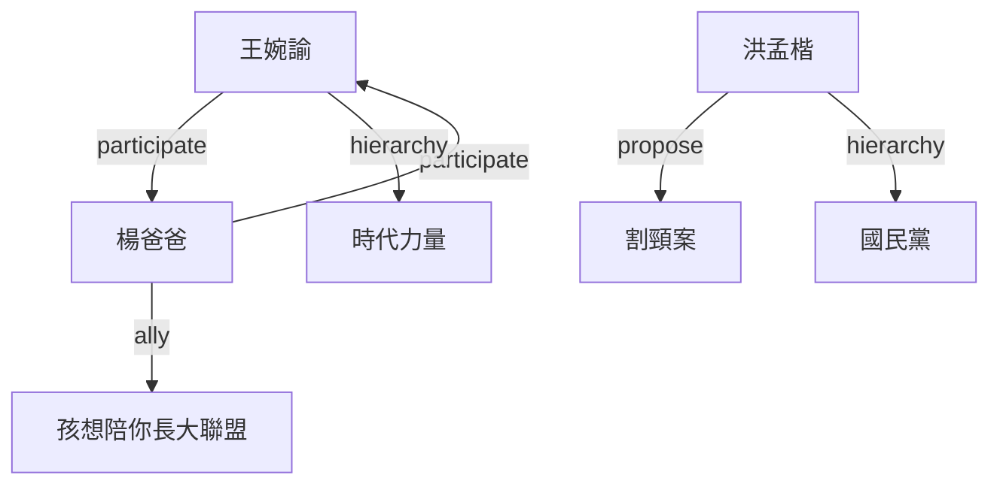

# 利害關係人網絡分析報告

**分析時間**: 2026-03-16 18:06:55

## 📋 執行摘要

- **總節點數**: 7
- **總關係數**: 6
- **網絡密度**: 0.286
- **平均連接數**: 1.71
- **最大連接數**: 3
- **已驗證關係比例**: 0%

## 🎯 關鍵行為者 (Top 5)

| 排名 | 名稱 | 類型 | 政黨 | 立場 | 連接數 |
|------|------|------|------|------|--------|
| 1 | 楊爸爸 | person | - | ⭐⭐⭐⭐⭐ | 3 |
| 2 | 王婉諭 | person | 時代力量 | ⭐⭐⭐⭐⭐ | 3 |
| 3 | 洪孟楷 | person | 國民黨 | ⭐⭐⭐⭐ | 2 |
| 4 | 時代力量 | party | - | ⭐⭐⭐⭐⭐ | 1 |
| 5 | 孩想陪你長大聯盟 | organization | - | ⭐⭐⭐⭐⭐ | 1 |

## 💪 關係強度分析

### 強度分布

| 強度區間 | 數量 | 比例 |
|----------|------|------|
| 高 (0.8-1.0) | 0 | 0.0% |
| 中-高 (0.6-0.8) | 6 | 100.0% |
| 中 (0.4-0.6) | 0 | 0.0% |
| 低-中 (0.2-0.4) | 0 | 0.0% |
| 低 (0.0-0.2) | 0 | 0.0% |

### 強關係 Top 5

| 來源 | 目標 | 強度 | 類型 |
|------|------|------|------|
| wang_wanyu | yang_dad | 0.70 | participate |
| yang_dad | wang_wanyu | 0.70 | participate |
| hung_meng_kai | cutting_neck_case | 0.70 | propose |
| hung_meng_kai | kmt | 0.60 | hierarchy |
| wang_wanyu | npp | 0.60 | hierarchy |

## 📂 互動類別分析

| 類別 | 數量 | 邊緣類型 | 平均強度 |
|------|------|----------|----------|
| general | 3 | hierarchy, ally | 0.60 |
| public_action | 2 | participate | 0.70 |
| legislative | 1 | propose | 0.70 |

## 🕸️ 網絡結構

## 💡 洞察與建議

### 網絡特徵

- **稀疏網絡**: 關係密度較低，可能存在未被記錄的關係
- **驗證需求**: 僅 0% 關係已驗證，建議加強資料驗證

### 建議行動

1. **強化核心關係**: 優先維護與關鍵行為者的連接
2. **擴展網絡覆蓋**: 尋找與現有節點有潛在關係的新行為者
3. **驗證關係品質**: 對高強度但未驗證的關係進行確認
4. **分類標準化**: 確保互動類別標記的一致性

---

*報告由 Graph Database Analysis Tool 產生*
