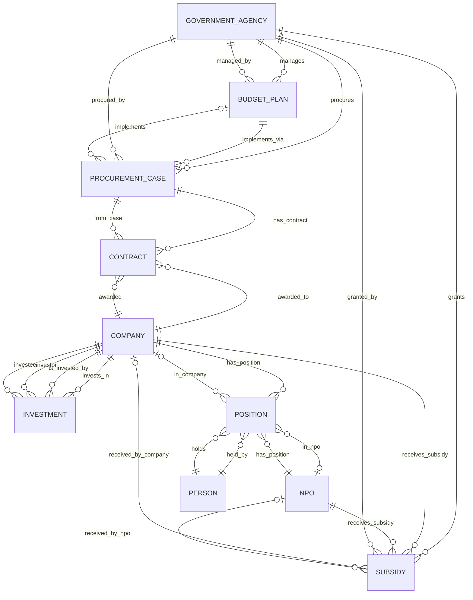

# 資料模型設計（Entity-Relationship Diagram）

## 實體（Entities）

### 1. GovernmentAgency（政府機關）

```python
class GovernmentAgency:
    agency_id: str           # 機關代碼
    name: str               # 機關名稱
    short_name: str         # 簡稱
    parent_agency: str      # 上級機關
    level: str             # 層級（中央/地方）
    category: str           # 類別（立法/行政/司法/考試/監察）
```

### 2. BudgetPlan（預算計畫）

```python
class BudgetPlan:
    plan_id: str            # 計畫編號
    agency_id: str          # 所屬機關
    year: int               # 年度
    plan_name: str          # 計畫名稱
    category: str           # 預算科目（政務分類）
    budget_amount: float    # 預算金額
    execution_amount: float # 執行金額
    description: str        # 計畫說明
```

### 3. ProcurementCase（標案）

```python
class ProcurementCase:
    case_id: str            # 標案案號（唯一識別）
    case_name: str          # 標案名稱
    agency_id: str          # 招標機關
    plan_id: str            # 所屬預算計畫（可選）
    
    # 招標資訊
    publish_date: date      # 公告日期
    bid_method: str         # 招標方式（公開招標/限制性招標/...）
    bid_type: str           # 採購性質（勞務/財物/工程）
    
    # 決標資訊
    award_date: date        # 決標日期
    award_amount: float     # 決標金額
    currency: str           # 幣別（TWD/USD/...）
    
    # 狀態
    status: str             # 狀態（招標中/決標/履約中/結案/流標）
    
    # 內容
    description: str        # 標案內容說明
    keywords: List[str]     # 關鍵字（自動提取）
```

### 4. Company（廠商）

```python
class Company:
    company_id: str         # 統一編號（唯一識別）
    name: str               # 公司名稱
    short_name: str         # 簡稱（去除「股份有限公司」等）
    
    # 基本資料
    representative: str     # 代表人姓名
    capital: float          # 資本額
    establish_date: date    # 成立日期
    company_type: str       # 公司類型（有限公司/股份有限公司/...）
    status: str             # 狀態（營業中/解散/...）
    
    # 聯絡資訊
    address: str            # 地址
    phone: str              # 電話
    
    # 行業資訊
    industry: str           # 行業別
    business_items: List[str]  # 營業項目
```

### 5. Person（人員）

```python
class Person:
    person_id: str          # 人員識別碼（內部生成）
    name: str               # 姓名
    aliases: List[str]      # 別名（簡體/繁體/暱稱）
    
    # 識別資訊（用於區分同名）
    birth_year: int         # 出生年（可選）
    identity_hints: str     # 識別提示（曾任職公司、學歷等）
    
    # 類型標記
    is_government_official: bool    # 是否公職人員
    is_company_representative: bool # 是否公司代表人
    is_npo_leader: bool            # 是否NPO理監事
```

### 6. Position（職位）

```python
class Position:
    position_id: str        # 職位識別碼
    person_id: str          # 人員
    entity_id: str          # 所屬實體（公司或NPO）
    entity_type: str        # 實體類型（company/npo）
    
    title: str              # 職稱
    position_type: str      # 類型（董事/監事/經理人/理監事/...）
    
    start_date: date        # 開始日期
    end_date: date          # 結束日期（None 表示現任）
    
    share_percentage: float # 持股比例（如適用）
```

### 7. NPO（非營利組織）

```python
class NPO:
    npo_id: str             # 組織識別碼
    name: str               # 組織名稱
    short_name: str         # 簡稱
    
    # 基本資料
    legal_form: str         # 法律形式（基金會/協會/...）
    register_number: str    # 登記字號
    establish_date: date    # 成立日期
    
    # 宗旨與業務
    purpose: str            # 設立宗旨
    business_scope: str     # 業務範圍
    keywords: List[str]     # 關鍵字（廢死/司法改革/...）
    
    # 地址
    address: str            # 地址
```

### 8. Subsidy（補助）

```python
class Subsidy:
    subsidy_id: str         # 補助識別碼
    
    # 補助方
    agency_id: str          # 補助機關
    
    # 受補助方
    recipient_type: str     # 受補助類型（npo/company/person）
    recipient_id: str       # 受補助對象ID
    
    # 補助資訊
    year: int               # 年度
    amount: float           # 補助金額
    project_name: str       # 計畫/專案名稱
    
    # 公職人員利益迴避資訊
    is_conflict_disclosure: bool    # 是否為利益迴避申報
    official_name: str              # 相關公職人員姓名
    relationship_type: str          # 關係類型（配偶/血親/...）
    
    # 來源
    source_url: str         # 資料來源網址
    disclosure_date: date  # 申報日期
```

### 9. Contract（契約/決標）

```python
class Contract:
    contract_id: str        # 契約識別碼
    case_id: str            # 所屬標案
    
    # 得標廠商
    company_id: str         # 得標廠商統編
    
    # 契約資訊
    award_amount: float     # 決標金額
    award_date: date        # 決標日期
    contract_period: int    # 契約期間（天數）
    
    # 投標資訊
    bid_count: int          # 投標廠商數
    is_single_bid: bool     # 是否獨家投標
    
    # 履約狀況
    execution_status: str   # 履約狀況（履約中/完成/終止）
    final_amount: float     # 最終結算金額（可能與決標不同）
```

### 10. Investment（投資關係）

```python
class Investment:
    investment_id: str      # 投資識別碼
    
    investor_id: str        # 投資者（公司或法人）
    investee_id: str        # 被投資者（公司）
    
    share_percentage: float # 持股比例
    investment_amount: float # 投資金額（如公開）
    
    as_of_date: date        # 資料日期
```

---

## 關係（Relationships）

### GovernmentAgency - BudgetPlan
```
MANAGES (管理)
GovernmentAgency 1:N BudgetPlan
機關編列多個預算計畫
```

### BudgetPlan - ProcurementCase
```
IMPLEMENTS_VIA (透過標案執行)
BudgetPlan 1:N ProcurementCase
預算計畫透過多個標案執行
```

### GovernmentAgency - ProcurementCase
```
PROCURES (招標)
GovernmentAgency 1:N ProcurementCase
機關招標多個標案
```

### ProcurementCase - Contract
```
HAS_CONTRACT (產生契約)
ProcurementCase 1:N Contract
一個標案可能分批決標，產生多個契約
```

### Company - Contract
```
AWARDED (得標)
Company 1:N Contract
廠商得標多個契約
```

### Company - Investment
```
INVESTS_IN (投資)
Company 1:N Investment
公司投資多個公司
IS_INVESTED_BY (被投資)
Company 1:N Investment
公司被多個公司投資
```

### Person - Company (via Position)
```
HOLDS_POSITION (擔任職位)
Person 1:N Position
人員擔任多個職位（不同公司、不同時期）

DIRECTS (擔任董監事)
Person N:M Company (透過 Position)
人員擔任公司董監事

REPRESENTS (代表)
Person 1:1 Company
人員擔任公司代表人（現任）
```

### Person - NPO (via Position)
```
LEADS (擔任理監事)
Person N:M NPO (透過 Position)
人員擔任 NPO 理監事
```

### GovernmentAgency - Subsidy
```
GRANTS (補助)
GovernmentAgency 1:N Subsidy
機關補助多個對象
```

### NPO - Subsidy
```
RECEIVES_SUBSIDY (接受補助)
NPO 1:N Subsidy
NPO 接受多個補助
```

### Company - Subsidy
```
RECEIVES_SUBSIDY (接受補助)
Company 1:N Subsidy
公司接受多個補助
```

---

## ERD 圖表（Mermaid 語法）



---

## 索引設計建議

為了支援查詢效能，建議以下索引：

### PostgreSQL 索引

```sql
-- 標案查詢
CREATE INDEX idx_procurement_agency ON procurement_cases(agency_id);
CREATE INDEX idx_procurement_date ON procurement_cases(award_date);
CREATE INDEX idx_procurement_status ON procurement_cases(status);
CREATE INDEX idx_procurement_keywords ON procurement_cases USING GIN(keywords);

-- 公司查詢
CREATE INDEX idx_company_name ON companies(name);
CREATE INDEX idx_company_representative ON companies(representative);

-- 人員職位查詢
CREATE INDEX idx_position_person ON positions(person_id);
CREATE INDEX idx_position_entity ON positions(entity_id, entity_type);
CREATE INDEX idx_position_dates ON positions(start_date, end_date);

-- 補助查詢
CREATE INDEX idx_subsidy_agency ON subsidies(agency_id);
CREATE INDEX idx_subsidy_recipient ON subsidies(recipient_id, recipient_type);
CREATE INDEX idx_subsidy_year ON subsidies(year);

-- 契約查詢
CREATE INDEX idx_contract_case ON contracts(case_id);
CREATE INDEX idx_contract_company ON contracts(company_id);
CREATE INDEX idx_contract_award_date ON contracts(award_date);
```

### Neo4j 圖形索引

```cypher
// 節點索引
CREATE INDEX company_name_idx FOR (c:Company) ON (c.name);
CREATE INDEX person_name_idx FOR (p:Person) ON (p.name);
CREATE INDEX agency_name_idx FOR (a:GovernmentAgency) ON (a.name);
CREATE INDEX npo_name_idx FOR (n:NPO) ON (n.name);

// 關係索引（自動建立）
```

---

## 資料表建立 SQL

參考 `scripts/create_database.sql` 以了解完整的 PostgreSQL Schema。
