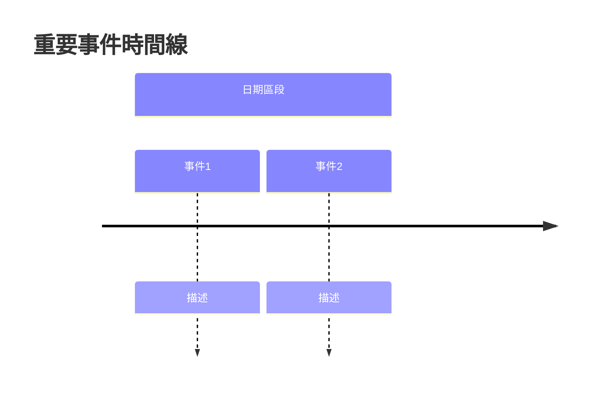

# 受害者家屬權益新聞追蹤器 (Victim Rights News Tracker)

## 概述

此技能用於系統性搜集台灣地區與受害者家屬相關的新聞報導、採訪、論述文章及人權團體活動資訊。目的是為生命權平等協會等非營利組織網站提供素材，特別關注：

- **司法不公議題**：突顯司法系統偏向加害者的案例
- **受害者家屬權益**：家屬的聲音、權利爭取歷程
- **人權團體活動**：為受害者家屬發聲的社會活動與倡議
- **立法與司法改善**：相關法案進展、制度改革、政策倡議
- **角色立場追蹤**：非營利組織、政黨、政治人物、法律人士在此議題上的發言與立場
- **連續事件追蹤**：特定案件的後續發展與報導

## 觸發條件與使用時機

### 應立即使用此技能當：

1. **首次完整搜集**
   - 使用者明確要求「搜集受害者家屬相關新聞」
   - 需要建立特定時間區段的完整資料庫
   - 範例：「請搜集過去一年關於受害者家屬權益的新聞」

2. **每日增量更新**
   - 每日工作天執行，比較昨日與今日的新聞差異
   - 範例：「執行每日新聞追蹤，找出今天的新報導」

3. **特定事件追蹤**
   - 註冊新 tag 追蹤特定案件或主題
   - 範例：「追蹤標籤 #某某案件 的最新進展」

4. **素材整理輸出**
   - 需要將搜集結果整理為 Markdown 格式供網站使用
   - 範例：「整理本月搜集的新聞為網站素材」

## 核心工作流程

### 工作流程 1：首次完整搜集 (Initial Collection)

**使用時機**：建立特定時間區段的完整新聞資料庫

**執行步驟**：

1. **確認搜集範圍**
   - 詢問使用者時間區段（例如：過去 6 個月、1 年、特定日期範圍）
   - 確認是否已有特定的關注案件或 tag

2. **執行多維度搜尋**
   
   使用 `websearch` 工具執行以下搜尋組合：
   
   **關鍵詞組 A - 受害者家屬權益**
   - "受害者家屬 權益 台灣"
   - "被害者家屬 人權 新聞"
   - "victim family rights Taiwan"
   
   **關鍵詞組 B - 司法不公議題**
   - "司法不公 加害者 受害者家屬"
   - "司法改革 被害人保護"
   - "judicial injustice victim family Taiwan"
   
   **關鍵詞組 C - 人權團體活動**
   - "生命權平等協會 活動"
   - "被害人保護協會 新聞"
   - "victim advocacy group Taiwan"
   
    **關鍵詞組 D - 立法與司法改善**
    - "刑事被害人保護法 修法"
    - "司法改革 被害人訴訟參與"
    - "被害人權益 法案"
    - "犯罪被害人保護法 修正案"
    - "立法保障 受害者家屬"
    
     **關鍵詞組 E - 特定案件追蹤**（如有指定）
     - 使用使用者提供的案件名稱或關鍵字
    
    **關鍵詞組 F - 角色立場追蹤**
    - "非營利組織 被害人保護 發言"
    - "人權團體 受害者家屬 聲明"
    - "民進黨 國民黨 民眾黨 被害人權益"
    - "立法委員 被害人保護 提案"
    - "法官 輕判 家屬 發言"
    - "律師 被害人權益 評論"

3. **篩選與分類**
   
   對每篇搜尋結果進行評估：
   - **相關性**：是否與受害者家屬權益直接相關
   - **地域性**：是否為台灣發生的事件（優先）或國際案例（次要）
   - **時效性**：發布日期是否在指定時間範圍內
   - **內容品質**：是否為完整報導（非僅標題或摘要）
   
    分類標籤：
    - `#司法不公` - 突顯司法偏向加害者的報導
    - `#家屬權益` - 關於受害者家屬權利爭取的報導
    - `#人權活動` - 人權團體為受害者發聲的活動
    - `#案件追蹤` - 特定案件的連續報導
    - `#國際案例` - 國際間相關案例（非台灣）
    - `#立法倡議` - 法案推動、修法進展
    - `#司法改善` - 制度改革、政策倡議、司改進展
    - `#NPO發聲` - 非營利組織發言、聲明、活動
    - `#政黨立場` - 政黨、政治人物相關發言與立場
    - `#法界觀點` - 法官、律師等法律人士的評論與見解

4. **整理輸出格式**
   
   使用 [references/output-templates.md](references/output-templates.md) 中的模板，產生：
   
   - **時間線圖表 (Mermaid)**：顯示重要事件時間順序
   - **分類清單**：依 tag 分類的新聞列表
   - **元資料記錄**：每篇新聞的標題、來源、日期、URL、圖片 URL、摘要

5. **建立 Tag 註冊表**
   
   將本次搜集涉及的重要案件、主題建立為 tag，記錄於 [references/tag-registry.md](references/tag-registry.md)，供後續追蹤使用。

### 工作流程 2：每日增量更新 (Daily Incremental Update)

**使用時機**：每個工作日執行，找出新的新聞報導

**執行步驟**：

1. **載入昨日資料**
   - 讀取前一次的搜集結果
   - 載入已註冊的 tag 清單

2. **執行差異搜尋**
   
   使用相同的關鍵詞組，但加入時間篩選：
   - 搜尋「過去 24 小時」或「今日」的新聞
   - 使用搜尋引擎的時間篩選功能（如可用）

3. **比對差異**
   
   使用 [scripts/diff_checker.py](scripts/diff_checker.py) 或手動比對：
   - 比對 URL：檢查是否為已存在的新聞
   - 比對標題：檢查相似度，避免重複
   - 標記新報導：`[NEW]` 標籤

4. **Tag 追蹤更新**
   
   檢查已註冊的每個 tag：
   - 搜尋該 tag 相關的新聞（限制時間為過去 24 小時）
   - 記錄該主題的最新進展
   - 更新 tag 的狀態（進行中/已結案/持續關注）

5. **產出差異報告**
   
    輸出格式：
    - **新增報導清單**：今日發現的新新聞
    - **Tag 更新摘要**：各追蹤主題的最新狀態
    - **立法司法改善摘要**：法案進展、制度改革等重要更新
    - **角色立場摘要**：NPO、政黨、政治人物、法界人士的發言與立場更新
    - **統計資訊**：今日新增數量、各類別分布

### 工作流程 4：角色立場追蹤與人物圖像建立 (Stakeholder Tracking)

**使用時機**：追踪非營利組織、政黨、政治人物、法律人士在此議題上的發言與立場，建立清楚的人物立場圖像

**執行步驟**：

1. **識別關鍵角色**
   
   在搜集過程中，識別以下角色的發言與行動：
   
   **A. 非營利組織 (NPOs)**
   - 人權團體：生命權平等協會、民間司法改革基金會、人權公約施行監督聯盟
   - 受害者支持組織：犯罪被害人保護協會
   - 其他相關NGO
   
   **B. 政黨與政治人物**
   - 主要政黨：民進黨、國民黨、民眾黨、時代力量等
   - 立法委員：司法法制委員會成員、相關提案立委
   - 地方首長：與重大案件相關的地方政府首長
   
   **C. 法界人士**
   - 法官：參與重大案件審判的法官、司法院發言人
   - 檢察官：案件承辦檢察官、檢察總長
   - 律師：受害者家屬代理律師、人權律師、法界評論者

2. **角色資訊擷取**
   
   對每個涉及的角色，記錄以下資訊：
   
   - **基本資料**：姓名、職稱、所屬組織/政黨
   - **發言內容**：直接引用或摘要其發言
   - **發言情境**：發言場合（記者會、立法院質詢、法庭、社群媒體等）
   - **立場傾向**：支持/反對/中立/未表態受害者家屬權益
   - **具體行動**：提案、聲明、參與活動、法律見解等
   - **時間脈絡**：首次發言日期、後續發展

3. **立場分類與標記**
   
   使用以下標記系統記錄角色立場：
   
   **立場標籤**：
   - `⭐⭐⭐⭐⭐` (強烈支持) - 積極推動修法、多次為家屬發聲、實質行動
   - `⭐⭐⭐⭐` (支持) - 公開表態支持、參與相關活動
   - `⭐⭐⭐` (中立) - 表示關注但未明確表態，或提出平衡觀點
   - `⭐⭐` (消極) - 態度模糊、迴避表態、僅官方客套話
   - `⭐` (反對/阻礙) - 明確反對家屬訴求、阻撓法案進度
   
   **角色類型標籤**：
   - `@組織` - 非營利組織（如 `@生命權平等協會`）
   - `@政黨` - 政黨官方（如 `@民進黨` `@國民黨`）
   - `@立委` - 立法委員（如 `@王婉諭` `@黃國昌`）
   - `@法官` - 法官（如 `@某某法官`）
   - `@檢察官` - 檢察官
   - `@律師` - 律師
   - `@官員` - 政府官員（如法務部長、司法院長等）

4. **建立人物檔案**
   
   為重要角色建立持續更新的檔案：
   
   ```markdown
   ### @[角色名稱]
   
   **角色類型**：NPO / 政黨 / 立委 / 法官 / 檢察官 / 律師 / 官員  
   **所屬組織**：XXX  
   **首次記錄日期**：YYYY-MM-DD  
   **最後更新日期**：YYYY-MM-DD  
   
   **立場傾向**：⭐⭐⭐⭐⭐ (強烈支持)  
   **立場摘要**：簡述其整體立場與態度...
   
   **發言記錄**：
   | 日期 | 場合 | 內容摘要 | 立場 | 來源 |
   |------|------|----------|------|------|
   | YYYY-MM-DD | 記者會 | 呼籲修法保障被害人權益 | ⭐⭐⭐⭐⭐ | [連結](https://example.com) |
   | YYYY-MM-DD | 立法院質詢 | 要求加重刑責 | ⭐⭐⭐⭐⭐ | [連結](https://example.com) |
   
   **具體行動**：
   - [行動1] 說明...（日期）
   - [行動2] 說明...（日期）
   
   **關聯Tag**：#立法倡議 #司法改善 #家屬權益
   
   **備註**：其他需要注意的事項
   ```

5. **關係網絡分析**
   
   使用 Mermaid 圖表建立角色關係圖：
   
   - **支持網絡**：哪些角色共同支持家屬權益
   - **反對陣營**：哪些角色持相反立場
   - **互動關係**：角色之間的公開互動（如辯論、聯合聲明等）
   - **影響力路徑**：誰影響了誰的立場或行動

6. **產出角色立場報告**
   
   定期產出彙整報告：
   
   - **角色立場總覽表**：所有追蹤角色的立場一覽
   - **新發言摘要**：本期新增的角色發言
   - **立場變化追蹤**：角色立場的轉變歷程
   - **人物關係圖**：視覺化呈現角色間的關係與立場分布

### 工作流程 5：關係網絡與立場分析 (Network Analysis)

**使用時機**：分析不同角色之間的互動關係，識別關鍵影響者與結盟模式

**執行步驟**：

1. **數據彙整**
   - 收集所有角色的發言與行動記錄
   - 整理時間序列資料

2. **關係識別**
   - 識別角色間的公開互動（如聯合聲明、公開辯論、互相引用等）
   - 標記關係類型：同盟、對立、中立、上下級等

3. **影響力分析**
   - 識別高頻發言者與關鍵決策者
   - 分析立場傳播路徑（誰影響了誰）

4. **視覺化呈現**
   
   使用 Mermaid 產出：
   - 角色立場分布圖
   - 關係網絡圖
   - 立場變化時間線

5. **策略建議**
   
   基於分析結果，提供：
   - 潛在結盟對象建議
   - 需要關注的反對勢力
   - 影響力最大化策略建議

### 工作流程 6：圖形資料庫管理與網站視覺化 (Graph Database Management)

**使用時機**：
- 需要建立結構化的角色關係資料庫
- 需要匯出資料供網站互動式視覺化使用
- 需要進行進階的網絡分析
- 需要將資料轉移至專業圖形資料庫（如 Neo4j）

**執行步驟**：

#### 階段 1：初始化本地圖形資料庫

1. **啟用 SQLite 圖形資料庫**
   
   使用 [scripts/graph_db.py](scripts/graph_db.py) 初始化本地資料庫：
   
   ```bash
   python scripts/graph_db.py --init
   ```
   
   這會在 `data/stakeholders_graph.db` 建立 SQLite 資料庫，包含：
   - **nodes 表**：人物、組織、案件節點
   - **edges 表**：關係（同盟、對立、互動等）
   - **statements 表**：發言記錄時間序列

2. **匯入現有角色資料**
   
   將已記錄的角色從 Markdown 檔案匯入資料庫：
   
   ```bash
   # 新增人物節點
   python scripts/graph_db.py --add-node "wang_wanyu" \
       --name "王婉諭" --type person --role "立委" \
       --party "時代力量" --stance 5 \
       --description "小燈泡案受害者母親，積極推動修法"
   
   # 新增組織節點
   python scripts/graph_db.py --add-node "victims_rights_assoc" \
       --name "生命權平等協會" --type organization --stance 5
   ```

#### 階段 2：建立關係網絡

1. **記錄角色互動關係**
   
   每當發現角色間的互動（聯合聲明、公開辯論等）：
   
   ```bash
   # 建立同盟關係
   python scripts/graph_db.py --add-edge "wang_wanyu" "victims_rights_assoc" \
       --type ally --interaction "聯合記者會" --date "2024-01-15"
   
   # 記錄質詢互動
   python scripts/graph_db.py --add-edge "wang_wanyu" "minister_of_justice" \
       --type interact --interaction "立法院質詢" --date "2024-01-10"
   ```

2. **記錄發言時間序列**
   
   為每個角色記錄發言歷史：
   
   ```bash
   python scripts/graph_db.py --add-statement "wang_wanyu" \
       --date "2024-01-15" --occasion "立法院質詢" \
       --content "要求加速被害人保護法修法進度" \
       --stance-mark 5 --source-url "https://..."
   ```

#### 階段 3：資料查詢與分析

1. **查詢個人網絡**
   
   查看某角色周邊的人物網絡：
   
   ```bash
   python scripts/graph_db.py --query-network "wang_wanyu" --depth 2
   ```
   
   這會顯示王婉諭直接關聯的角色，以及這些角色的關聯角色（二度關係）。

2. **查看統計資訊**
   
   取得整體網絡統計：
   
   ```bash
   python scripts/graph_db.py --stats
   ```
   
   輸出：
   - 總節點數、關係數、發言數
   - 節點類型分布（人物/組織/政黨等）
   - 立場分布（⭐星級統計）
   - 關係類型分布（同盟/對立/互動等）

#### 階段 4：匯出網站視覺化格式

執行一鍵匯出所有格式：

```bash
python scripts/export_graph.py
```

這會在 `export/` 目錄產生以下檔案：

**A. 網站前端格式（推薦）**

| 檔案 | 格式 | 用途 | 推薦套件 |
|------|------|------|----------|
| `stakeholders_cytoscape.json` | Cytoscape.js | 互動式網路圖 | [Cytoscape.js](https://js.cytoscape.org/) |
| `stakeholders_d3.json` | D3.js | 力導向動態圖 | [D3.js](https://d3js.org/) |

**特色**：
- 節點顏色依立場自動標記（紅=支持、黃=中立、藍=反對）
- 節點形狀依類型區分（圓形=人物、方塊=組織、六角形=政黨）
- 支援節點拖曳、縮放、點擊查看詳情
- 關係線可顯示互動類型（記者會、質詢等）

**B. 專業圖形工具格式**

| 檔案 | 格式 | 用途 | 適用工具 |
|------|------|------|----------|
| `stakeholders.graphml` | GraphML | 專業圖形分析 | Neo4j, Gephi, Cytoscape Desktop |

**特色**：
- 標準 XML 格式，通用性高
- 包含完整節點屬性（立場、角色、政黨等）
- 可直接匯入 Neo4j 進行進階圖形分析
- 支援 Gephi 視覺化與社群分析

**C. 資料分析格式**

| 檔案 | 格式 | 用途 | 適用工具 |
|------|------|------|----------|
| `stakeholders_nodes.csv` | CSV | 節點資料表 | Excel, R, Python Pandas |
| `stakeholders_edges.csv` | CSV | 關係資料表 | Excel, R, Python Pandas |

**特色**：
- 表格形式，易於篩選與排序
- 可在 Excel 中進行樞紐分析
- 方便與其他資料整合

**D. 匯出報告**

| 檔案 | 用途 |
|------|------|
| `graph_export_report.md` | 完整匯出說明與統計 |

#### 階段 5：網站整合

**使用 Cytoscape.js 呈現（推薦）**

將 `stakeholders_cytoscape.json` 整合至網站：

```html
<!-- 在網頁中顯示互動式人物關係圖 -->
<div id="stakeholder-network"></div>

<script src="https://unpkg.com/cytoscape@3.26.0/dist/cytoscape.min.js"></script>
<script>
fetch('stakeholders_cytoscape.json')
  .then(response => response.json())
  .then(data => {
    var cy = cytoscape({
      container: document.getElementById('stakeholder-network'),
      elements: data,
      style: [
        { selector: 'node', style: { 'label': 'data(label)' } },
        { selector: 'edge', style: { 'label': 'data(label)' } }
      ],
      layout: { name: 'cose', padding: 10 }
    });
  });
</script>
```

**視覺化效果**：
- 節點顏色自動反映立場（紅=支持、藍=反對）
- 可拖曳節點調整布局
- 點擊節點顯示詳細資訊（角色、發言歷史）
- 縮放與平移探索整體網絡

#### 階段 6：遷移至正式 Graph DB（可選）

**匯入 Neo4j**

如需更強大的圖形分析能力，可將資料遷移至 Neo4j：

```bash
# 使用 GraphML 匯入
neo4j-admin import --database victimrights \
    --nodes import/stakeholders_nodes.csv \
    --relationships import/stakeholders_edges.csv
```

或使用 Cypher 查詢語言：

```cypher
// 載入節點
LOAD CSV WITH HEADERS FROM 'file:///stakeholders_nodes.csv' AS row
CREATE (n:Person {id: row.id, name: row.name, stance: toInteger(row.stance)})

// 載入關係
LOAD CSV WITH HEADERS FROM 'file:///stakeholders_edges.csv' AS row
MATCH (a {id: row.source}), (b {id: row.target})
CREATE (a)-[r:INTERACTS {type: row.type}]->(b)

// 執行進階查詢：找出所有支持者的同盟關係
MATCH (n)-[r:ALLY]->(m)
WHERE n.stance >= 4 AND m.stance >= 4
RETURN n.name, m.name, r.interaction
```

**Neo4j 優勢**：
- 支援複雜圖形查詢（最短徑、社群偵測）
- 視覺化瀏覽器 (Neo4j Browser)
- 企業級規模支援
- Cypher 查詢語言直覺易用

#### 圖形資料庫最佳實踐

**資料維護**：
- 定期備份 `data/stakeholders_graph.db`
- 每日更新時同步更新資料庫
- 保留歷史快照供趨勢分析

**命名規範**：
- 節點 ID：使用英文小寫 + 底線（如 `wang_wanyu`）
- 類型標記：`person`, `organization`, `party`, `official`, `case`
- 關係類型：`ally`, `oppose`, `interact`, `hierarchy`

**效能建議**：
- 節點數超過 1000 時，考慮遷移至 Neo4j
- 定期執行 `python graph_db.py --stats` 監控資料規模

## 搜尋策略與關鍵詞

詳細的搜尋關鍵詞組合與查詢模板，請參考 [references/search-queries.md](references/search-queries.md)。

### 搜尋來源建議

**中文媒體**：
- 主流新聞網站：中央社、聯合報、自由時報、中國時報
- 司法專題：司法院新聞、法律相關媒體
- 人權團體網站：生命權平等協會、民間司法改革基金會

**英文媒體**：
- Taiwan News, Focus Taiwan
- 國際人權組織報導

## 輸出格式規範

### Markdown 報告結構

```markdown
# 受害者家屬權益新聞追蹤報告

**報告日期**：YYYY-MM-DD  
**時間區段**：YYYY-MM-DD 至 YYYY-MM-DD  
**報告類型**：首次搜集 / 每日增量

---

## 摘要統計

- 總計新聞數量：XX 篇
- 新增報導：XX 篇（增量更新時）
- 主要類別分布：
  - 司法不公：XX 篇
  - 家屬權益：XX 篇
  - 人權活動：XX 篇

---

## 時間線圖表



---

## 類別一：司法不公議題

### [NEW] 報導標題
- **來源**：[媒體名稱](https://example.com)
- **日期**：YYYY-MM-DD
- **圖片**：[圖片 URL]（如有）
- **摘要**：內容摘要...
- **標籤**：#司法不公 #案件追蹤

---

## 已註冊 Tag 追蹤狀態

| Tag | 狀態 | 最後更新 | 關鍵進展 |
|-----|------|----------|----------|
| #案件名稱 | 進行中 | YYYY-MM-DD | 簡要說明 |

---

## 資料來源

本次報告搜集自以下來源：
- [來源1](https://example.com)
- [來源2](https://example.com)
```

完整的模板與範例，請參考 [references/output-templates.md](references/output-templates.md)。

## 注意事項與最佳實踐

### 內容篩選原則

1. **真實性驗證**：優先使用主流媒體報導，謹慎引用論壇或部落格內容
2. **平衡報導**：雖然關注受害者家屬，但仍需保持報導的客觀性描述
3. **隱私保護**：注意受害者家屬個人隱私資訊的處理
4. **版權聲明**：使用新聞摘要時注意合理使用範圍，標註來源

### 執行頻率建議

- **首次搜集**：依時間區段大小，可能需要分批執行
- **每日更新**：每個工作日執行一次，建議早上 9-10 點（新聞已發布）
- **Tag 追蹤**：每日更新時一併檢查，重大案件可增至每日兩次

### 資料保存

建議將每次報告保存為獨立 Markdown 檔案，檔名格式：
- 首次搜集：`victim-news-initial-YYYYMMDD.md`
- 每日更新：`victim-news-daily-YYYYMMDD.md`

## 資源檔案說明

此技能包含以下參考資源：

### 主要文件
- **[references/search-queries.md](references/search-queries.md)**：完整的搜尋關鍵詞清單與查詢模板
- **[references/tag-registry.md](references/tag-registry.md)**：Tag 註冊表格式與管理指南，含角色立場追蹤系統
- **[references/output-templates.md](references/output-templates.md)**：Markdown 輸出模板與 Mermaid 圖表範例，含網站視覺化範本
- **[references/graph-db-guide.md](references/graph-db-guide.md)**：圖形資料庫使用詳細指南
- **[references/stance-assessment-guidelines.md](references/stance-assessment-guidelines.md)**：立場評估標準化準則
- **[references/FMEA-report.md](references/FMEA-report.md)**：FMEA 風險分析與改善報告

### 工具腳本
- **[scripts/diff_checker.py](scripts/diff_checker.py)**：新舊新聞差異比對工具
- **[scripts/graph_db.py](scripts/graph_db.py)**：本地 SQLite 圖形資料庫管理工具
  - 功能：節點管理、關係建立、發言記錄
  - 支援多格式匯出：Cytoscape.js、D3.js、GraphML、CSV
- **[scripts/export_graph.py](scripts/export_graph.py)**：一鍵匯出所有圖形格式
- **[scripts/db_maintenance.py](scripts/db_maintenance.py)**：資料庫備份與維護工具
- **[scripts/tag_validator.py](scripts/tag_validator.py)**：Tag 命名標準檢查工具

### 資料目錄
- **data/**：本地 SQLite 資料儲存
  - `stakeholders_graph.db`：角色關係圖形資料庫
- **backup/**：自動備份儲存
- **export/**：圖形資料匯出目錄
  - `stakeholders_cytoscape.json`：網站互動圖
  - `stakeholders_d3.json`：D3.js 力導向圖
  - `stakeholders.graphml`：Neo4j/Gephi
  - `stakeholders_nodes.csv` / `stakeholders_edges.csv`：CSV資料表
  - `graph_export_report.md`：匯出報告

---

## 附錄
