# 輸出模板與 Mermaid 圖表範例

本文檔提供受害者家屬權益新聞追蹤報告的 Markdown 輸出模板與 Mermaid 圖表範例。

## 報告類型

### 類型 1：首次完整搜集報告

適用於建立特定時間區段的完整新聞資料庫。

#### 模板結構

```markdown
# 受害者家屬權益新聞完整搜集報告

**報告日期**：2024-01-15  
**時間區段**：2023-07-01 至 2024-01-15  
**報告類型**：首次完整搜集  
**搜集範圍**：台灣地區受害者家屬相關新聞

---

## 執行摘要

本次報告針對**時間區段**內的受害者家屬權益相關新聞進行完整搜集，旨在建立完整的素材資料庫，供生命權平等協會網站使用。

### 統計概覽

| 類別 | 數量 | 占比 |
|------|------|------|
| 司法不公議題 | XX 篇 | XX% |
| 家屬權益爭取 | XX 篇 | XX% |
| 人權團體活動 | XX 篇 | XX% |
| 特定案件追蹤 | XX 篇 | XX% |
| 國際相關案例 | XX 篇 | XX% |
| **總計** | **XX 篇** | **100%** |

### 重要發現

1. **[發現 1]**：描述...
2. **[發現 2]**：描述...
3. **[發現 3]**：描述...

---

## 重要事件時間線

### 整體時間線概覽

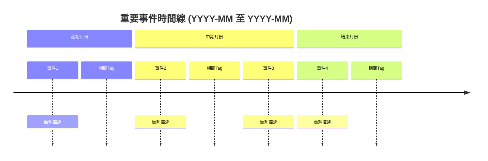

### 詳細事件列表

#### [月份/年份]

| 日期 | 事件 | 相關Tag | 重要程度 |
|------|------|---------|----------|
| YYYY-MM-DD | 事件描述 | #Tag1 #Tag2 | ⭐⭐⭐ |
| YYYY-MM-DD | 事件描述 | #Tag3 | ⭐⭐ |

---

## 類別一：司法不公議題

### 概述

本類別收錄突顯司法系統偏向加害者、輕判爭議等相關報導。

**統計**：共 XX 篇報導

### 重要報導

#### 1. [報導標題]

- **來源**：[媒體名稱](URL)
- **日期**：YYYY-MM-DD
- **記者**：XXX
- **圖片**：[圖片描述與URL](圖片URL)
- **摘要**：
  > 報導內容摘要，突顯司法不公的具體情況...
- **關鍵引用**：
  > 「受害者家屬表示...」
- **標籤**：#司法不公 #輕判爭議 #案件名稱
- **重要程度**：⭐⭐⭐
- **後續發展**：如有後續報導，簡要說明

---

## 類別二：家屬權益爭取

### 概述

本類別收錄受害者家屬爭取權益、參與司法程序等相關報導。

**統計**：共 XX 篇報導

### 重要報導

#### 1. [報導標題]

- **來源**：[媒體名稱](URL)
- **日期**：YYYY-MM-DD
- **記者**：XXX
- **圖片**：[圖片描述與URL](圖片URL)
- **摘要**：
  > 報導內容摘要...
- **關鍵引用**：
  > 「家屬強調...」
- **標籤**：#家屬權益 #訴訟參與
- **重要程度**：⭐⭐⭐

---

## 類別三：人權團體活動

### 概述

本類別收錄人權團體（如生命權平等協會）為受害者家屬發聲的活動報導。

**統計**：共 XX 篇報導

### 重要活動

#### 活動 1：[活動名稱]

- **主辦單位**：[組織名稱]
- **日期**：YYYY-MM-DD
- **地點**：XXX
- **來源**：[媒體報導](URL)
- **圖片**：[活動照片URL](圖片URL)
- **活動內容**：
  > 活動描述...
- **參與家屬**：如有提及，列出受害者家屬代表
- **標籤**：#人權活動 #生命權平等協會
- **相關影音**：[如有影片連結](影片URL)

---

## 類別四：特定案件追蹤

### 案件 1：[案件名稱]

#### 案件時間線

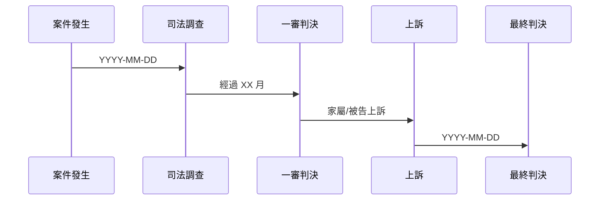

#### 相關報導列表

| # | 日期 | 標題 | 來源 | 重點摘要 | 標籤 |
|---|------|------|------|----------|------|
| 1 | YYYY-MM-DD | [標題](URL) | 媒體 | 重點 | #案件名稱 |
| 2 | YYYY-MM-DD | [標題](URL) | 媒體 | 重點 | #案件名稱 |

#### 案件摘要

- **案件類型**：XXX
- **發生日期**：YYYY-MM-DD
- **受害者**：XXX
- **加害者**：XXX
- **目前狀態**：進行中/已判決/已結案
- **關鍵爭點**：
  1. 爭點1
  2. 爭點2
- **家屬訴求**：
  - 訴求1
  - 訴求2

---

## 新註冊 Tag 清單

本次搜集發現並註冊了以下新 Tag：

| Tag | 類型 | 案件/主題描述 | 相關報導數 | 追蹤狀態 |
|-----|------|---------------|------------|----------|
| #案件名稱 | 案件 | 簡短描述 | XX 篇 | 進行中 |
| #主題名稱 | 主題 | 簡短描述 | XX 篇 | 持續關注 |

---

## 資料來源

本次報告搜集自以下來源：

### 中文媒體
- 中央通訊社 (cna.com.tw)
- 聯合新聞網 (udn.com)
- 自由時報 (ltn.com.tw)
- [其他來源...]

### 英文媒體
- Taiwan News
- Focus Taiwan
- [其他來源...]

### 組織網站
- 生命權平等協會
- 民間司法改革基金會
- [其他來源...]

---

## 附錄

### 附錄 A：完整新聞清單

[如需要，可在此附上完整的 CSV 或表格格式清單]

### 附錄 B：圖片素材清單

| 圖片描述 | 來源報導 | 圖片URL | 版權狀態 |
|----------|----------|---------|----------|
| 描述... | [報導標題](URL) | [URL](URL) | 合理使用 |

### 附錄 C：搜尋關鍵詞記錄

本次搜集使用的關鍵詞組合：
- 關鍵詞組 A：...
- 關鍵詞組 B：...

---

**報告製作**：Victim Rights News Tracker Skill  
**製作日期**：YYYY-MM-DD  
**版本**：v1.0
```

---

### 類型 2：每日增量更新報告

適用於每個工作日的差異更新。

#### 模板結構

```markdown
# 受害者家屬權益新聞每日更新報告

**報告日期**：2024-01-15（星期一）  
**報告類型**：每日增量更新  
**比對基準**：2024-01-14 報告

---

## 更新摘要

### 今日新增統計

| 類別 | 新增數量 | 重要報導 |
|------|----------|----------|
| 司法不公議題 | X 篇 | [標題簡述] |
| 家屬權益爭取 | X 篇 | [標題簡述] |
| 人權團體活動 | X 篇 | [標題簡述] |
| 特定案件追蹤 | X 篇 | [標題簡述] |
| **總計** | **X 篇** | - |

### 重點更新

🔴 **重大更新**：[簡短描述今日最重要的 1-2 則新聞]

🟡 **持續關注**：[其他值得注意的更新]

---

## 新增報導詳情

### [NEW] 報導標題 1

- **來源**：[媒體名稱](URL)
- **日期**：YYYY-MM-DD
- **圖片**：[圖片URL](圖片URL)
- **摘要**：簡短摘要...
- **關鍵引用**：「...」
- **標籤**：#司法不公 #案件名稱
- **重要性**：⭐⭐⭐⭐⭐（5/5）
- **後續追蹤建議**：建議持續追蹤後續發展

### [NEW] 報導標題 2

[...]

---

## Tag 追蹤更新

### 進行中案件狀態

| Tag | 昨日狀態 | 今日更新 | 狀態變更 |
|-----|----------|----------|----------|
| #案件A | 進行中 | 新報導1篇 | 無變更 |
| #案件B | 待開庭 | 開庭日期確定 | → 已開庭 |

### 重大進展通知

#### #案件名稱

- **狀態變更**：待開庭 → 已判決
- **更新日期**：YYYY-MM-DD
- **判決結果**：簡述...
- **家屬反應**：簡述...
- **後續行動**：簡述...
- **相關新聞**：[報導連結](URL)

---

## 快速連結

### 今日新增報導

1. [報導標題 1](URL) - 媒體名稱
2. [報導標題 2](URL) - 媒體名稱
3. [...]

### 需要後續追蹤

- [ ] 追蹤 #案件名稱 的後續報導
- [ ] 確認 #活動名稱 的相關照片授權
- [ ] [...]

---

**下次更新**：2024-01-16（星期二）  
**報告製作**：Victim Rights News Tracker Skill
```

---

### 類型 3：特定 Tag 追蹤報告

適用於查詢特定案件或主題的完整時間線。

#### 模板結構

```markdown
# Tag 追蹤報告：[Tag 名稱]

**Tag**：#[Tag 名稱]  
**報告日期**：2024-01-15  
**追蹤起始**：YYYY-MM-DD  
**追蹤狀態**：進行中/已結案/持續關注

---

## 案件/主題概述

### 基本資訊

- **案件類型**：XXX
- **發生日期**：YYYY-MM-DD
- **主要當事人**：
  - 受害者：XXX
  - 加害者：XXX（如適用）
  - 家屬代表：XXX
- **目前狀態**：簡述...
- **關鍵爭點**：
  1. 爭點1
  2. 爭點2

### 案件背景

[簡要敘述案件經過，2-3 段]

---

## 完整時間線

### 視覺化時間線

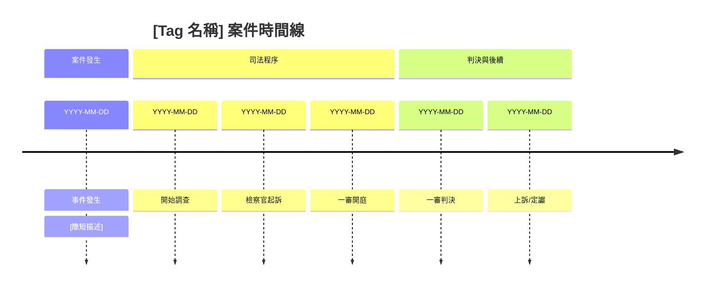

### 詳細時間線

| 階段 | 日期 | 事件 | 重要報導 | 家屬相關行動 |
|------|------|------|----------|--------------|
| 發生 | YYYY-MM-DD | 案件發生 | [報導](URL) | - |
| 調查 | YYYY-MM-DD | 警方調查 | [報導](URL) | 家屬首次發聲 |
| 起訴 | YYYY-MM-DD | 檢察官起訴 | [報導](URL) | 家屬表達訴求 |
| 一審 | YYYY-MM-DD | 一審判決 | [報導](URL) | 家屬抗議輕判 |
| 上訴 | YYYY-MM-DD | 二審開庭 | [報導](URL) | 持續參與訴訟 |

---

## 相關報導清單

### 依時間排序（最新在前）

| # | 日期 | 標題 | 來源 | 摘要 | 重要程度 |
|---|------|------|------|------|----------|
| 1 | YYYY-MM-DD | [標題](URL) | 媒體 | 摘要... | ⭐⭐⭐⭐⭐ |
| 2 | YYYY-MM-DD | [標題](URL) | 媒體 | 摘要... | ⭐⭐⭐⭐ |
| ... | ... | ... | ... | ... | ... |

### 依類別分類

#### 司法程序報導

[列出相關報導...]

#### 家屬發聲報導

[列出相關報導...]

#### 社會關注報導

[列出相關報導...]

---

## 家屬相關資訊

### 家屬代表

- **姓名**：XXX（如公開資訊）
- **與受害者關係**：XXX
- **公開發言**：
  - YYYY-MM-DD：「...」[來源](URL)
  - YYYY-MM-DD：「...」[來源](URL)

### 家屬訴求

1. **訴求 1**：描述...
2. **訴求 2**：描述...

### 家屬參與的活動

| 日期 | 活動類型 | 內容 | 報導連結 |
|------|----------|------|----------|
| YYYY-MM-DD | 記者會 | 說明... | [報導](URL) |
| YYYY-MM-DD | 陳情 | 說明... | [報導](URL) |

---

## 媒體報導分析

### 報導趨勢

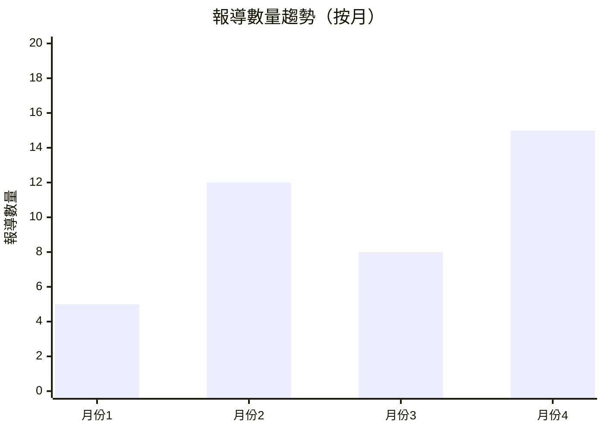

### 媒體分布

| 媒體 | 報導數量 | 占比 |
|------|----------|------|
| 聯合報 | XX | XX% |
| 自由時報 | XX | XX% |
| 中國時報 | XX | XX% |
| 中央社 | XX | XX% |
| 其他 | XX | XX% |

---

## 相關 Tag

### 並用 Tag

本次追蹤中，此 Tag 常與以下 Tag 並用：

- #司法不公（XX 次）
- #家屬權益（XX 次）
- #案件追蹤（XX 次）

### 相關案件/主題

- [相關 Tag 1]：簡短說明關聯性
- [相關 Tag 2]：簡短說明關聯性

---

## 最新狀態與後續追蹤

### 目前狀態

- **司法狀態**：進行中/已判決/已結案
- **家屬狀態**：持續爭取權益/已接受判決/其他
- **社會關注度**：高/中/低

### 預計後續發展

1. **近期（1 個月內）**：預計...
2. **中期（3 個月內）**：預計...

### 追蹤建議

- [ ] 持續追蹤後續司法程序
- [ ] 關注家屬相關發聲
- [ ] [...]

---

**報告製作**：Victim Rights News Tracker Skill  
**最後更新**：YYYY-MM-DD
```

---

## Mermaid 圖表範例

### 1. 基本時間線 (Timeline)

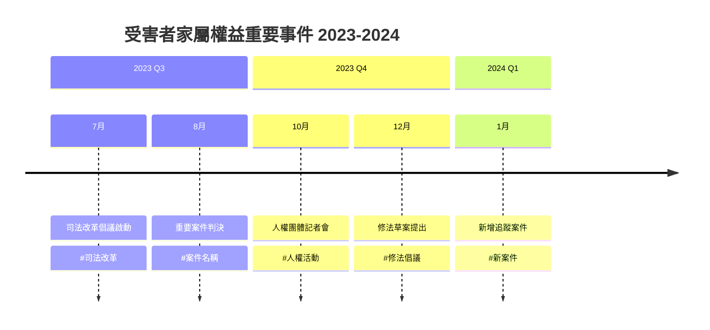

### 2. 甘特圖 (Gantt Chart)

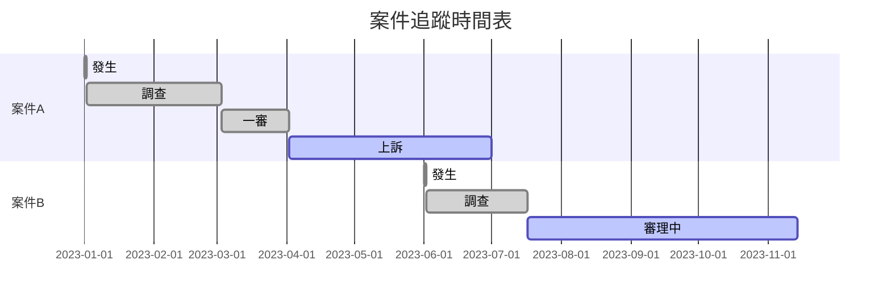

### 3. 流程圖 (Flowchart)

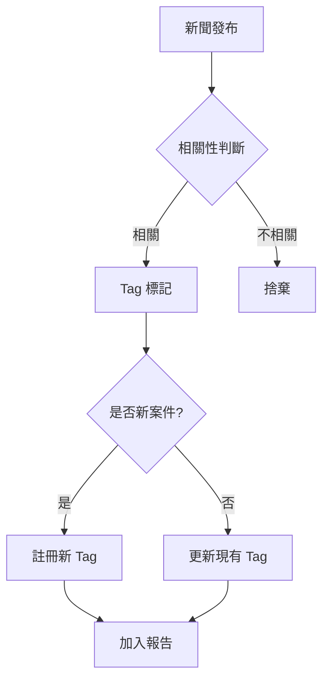

### 4. 循序圖 (Sequence Diagram)

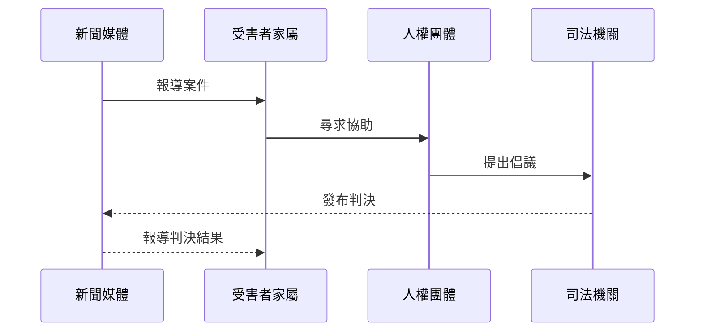

### 5. 長條圖 (Bar Chart)

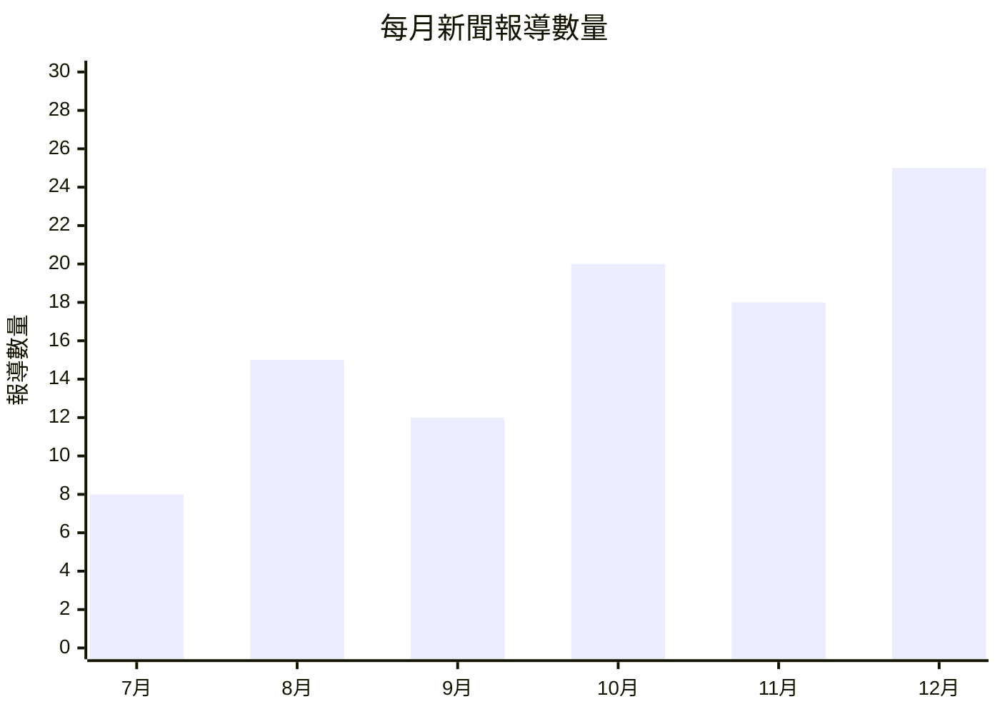

### 6. 關聯圖 (Graph)

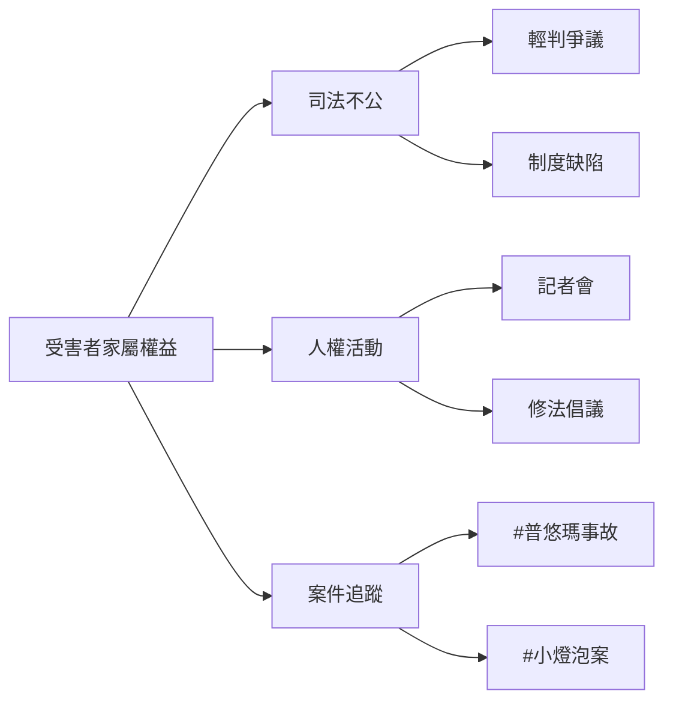

---

## 輸出格式最佳實踐

### 1. 標準化元資料

每份報告應包含：
- 報告日期
- 時間區段
- 報告類型
- 總計報導數量

### 2. 一致性標記

- 使用 `[NEW]` 標記新增報導
- 使用 `⭐` 標記重要程度（1-5 星）
- 使用 `[圖片]` 標記圖片連結

### 3. URL 處理

- 所有來源都應提供完整 URL
- 使用 Markdown 連結格式：`[顯示文字](URL)`
- 圖片 URL 應測試是否可存取

### 4. 摘要撰寫

- 保持客觀中立
- 突顯與受害者家屬相關的內容
- 引用關鍵發言時使用引號
- 長篇報導摘要控制在 100-200 字

### 5. 雙語內容處理

當搜集到中英文新聞時：

```markdown
### [中文標題]
- **來源**：[中文媒體](URL)
- **摘要**：中文摘要...
- **English Summary**: Brief English summary...

### [English Title]
- **Source**: [English Media](URL)
- **Summary**: English summary...
- **中文摘要**: 中文摘要...
```

或採用並列格式：

```markdown
| 語言 | 標題 | 來源 | 摘要 |
|------|------|------|------|
| 中文 | [標題](URL) | 媒體A | 摘要... |
| EN | [Title](URL) | Media B | Summary... |
```

---

## 檔案命名建議

建議使用以下命名格式保存報告：

```
首次搜集：victim-news-initial-{YYYYMMDD}-{時間區段}.md
每日更新：victim-news-daily-{YYYYMMDD}.md
Tag追蹤：victim-news-tag-{tag-name}-{YYYYMMDD}.md
月度彙整：victim-news-monthly-{YYYY-MM}.md
```

範例：
- `victim-news-initial-20240115-20230701-20240115.md`
- `victim-news-daily-20240115.md`
- `victim-news-tag-puyuma-20240115.md`
- `victim-news-monthly-2024-01.md`
- `victim-news-stakeholders-{YYYYMMDD}.md`（角色立場報告）

---

## 類型 4：角色立場追蹤報告

適用於彙整非營利組織、政黨、政治人物、法界人士在此議題上的立場與發言。

### 模板結構

```markdown
# 角色立場追蹤報告

**報告日期**：2024-01-15  
**報告期間**：YYYY-MM-DD 至 YYYY-MM-DD  
**報告類型**：角色立場彙整 / 人物圖像建立

---

## 執行摘要

本報告彙整本期間內各關鍵角色在受害者家屬權益議題上的發言與立場，建立清楚的人物立場圖像。

### 本期重要發現

1. **[發現1]**：例如「時代力量立委持續積極推動修法，立場最為明確」
2. **[發現2]**：例如「民進黨官方態度較為保守，尚未明確表態」
3. **[發現3]**：例如「法界出現立場分歧，部分法官支持擴大被害人參與」

### 統計概覽

| 角色類型 | 新發言數 | 強烈支持(⭐⭐⭐⭐⭐) | 支持(⭐⭐⭐⭐) | 中立(⭐⭐⭐) | 消極(⭐⭐) | 反對(⭐) |
|----------|----------|-------------------|--------------|------------|----------|----------|
| NPO/人權團體 | XX | XX | XX | XX | XX | XX |
| 政黨/政治人物 | XX | XX | XX | XX | XX | XX |
| 法界人士 | XX | XX | XX | XX | XX | XX |

---

## 人物關係網絡圖

### 立場分布圖

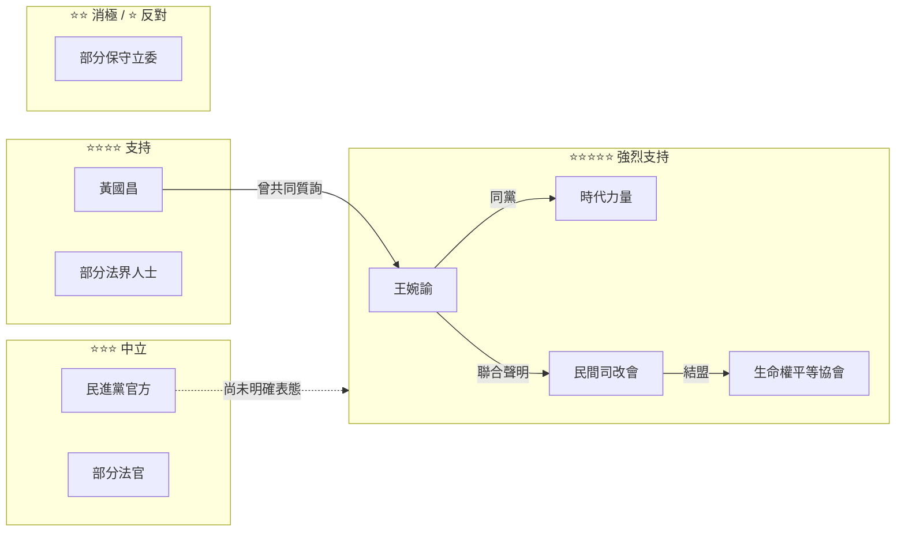

### 影響力路徑圖

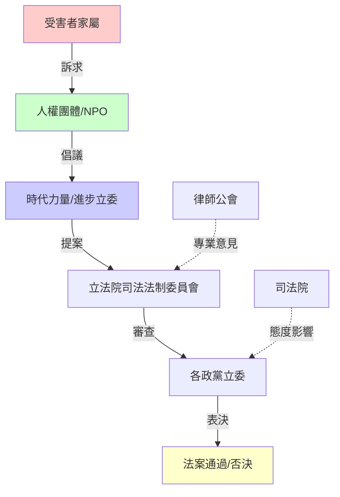

---

## 角色立場詳細記錄

### 一、非營利組織 / 人權團體

#### @生命權平等協會

**角色類型**：NPO  
**立場傾向**：⭐⭐⭐⭐⭐ (強烈支持)  
**立場摘要**：最積極的倡議團體之一，持續為受害者家屬發聲，多次舉辦記者會與活動。

**本期發言記錄**：
| 日期 | 場合 | 內容摘要 | 立場 | 來源 |
|------|------|----------|------|------|
| YYYY-MM-DD | 記者會 | 呼籲加速修法進度，批評司法忽視家屬權益 | ⭐⭐⭐⭐⭐ | [聯合報](URL) |
| YYYY-MM-DD | 聯合聲明 | 與其他NPO共同聲明支持被害人訴訟參與入法 | ⭐⭐⭐⭐⭐ | [中央社](URL) |

**具體行動**：
- 舉辦「被害人權益保障」公聽會（YYYY-MM-DD）
- 提交修法建議書至立法院（YYYY-MM-DD）

**關聯角色**：
- **同盟**：@民間司法改革基金會 @人權公約施行監督聯盟
- **互動**：與@王婉諭立委辦公室密切合作

**關聯Tag**：#NPO發聲 #人權活動 #立法倡議

---

#### @民間司法改革基金會

**角色類型**：NPO  
**立場傾向**：⭐⭐⭐⭐⭐ (強烈支持)  
**立場摘要**：長期關注司法改革與被害人權益，提出多項制度建議。

[... 繼續記錄其他NPO ...]

---

### 二、政黨與政治人物

#### @時代力量（政黨官方）

**角色類型**：政黨  
**立場傾向**：⭐⭐⭐⭐⭐ (強烈支持)  
**立場摘要**：全黨力挺被害人權益保障，將此議題列為優先法案。

**本期發言/行動**：
| 日期 | 場合 | 內容摘要 | 立場 | 來源 |
|------|------|----------|------|------|
| YYYY-MM-DD | 黨團記者會 | 宣布優先推動《刑事被害人保護法》修法 | ⭐⭐⭐⭐⭐ | [自由時報](URL) |

**黨內關鍵人物**：
- @王婉諭（司法法制委員會，主要推動者）
- @黃國昌（黨團總召，協調資源）

**關聯角色**：
- **同盟**：@生命權平等協會 @民間司法改革基金會

---

#### @民進黨（政黨官方）

**角色類型**：政黨  
**立場傾向**：⭐⭐⭐ (中立)  
**立場摘要**：執政黨態度較為保守，法務部表示「持續研議」，尚未明確表態支持修法。

**本期發言/行動**：
| 日期 | 場合 | 內容摘要 | 立場 | 來源 |
|------|------|----------|------|------|
| YYYY-MM-DD | 記者詢問 | 「尊重立法院審查，將評估法案影響」 | ⭐⭐⭐ | [中央社](URL) |

**關鍵人物發言**：
- **@OOO立委**（司法法制委員會）：表示支持修法，願意擔任提案連署人（⭐⭐⭐⭐）
- **法務部長**：「現行制度已有保障，將評估是否有修法必要」（⭐⭐）

**關聯角色**：
- **內部立場分歧**：部分立委支持，官方態度保守

---

#### @王婉諭

**角色類型**：立委  
**所屬組織**：時代力量  
**立場傾向**：⭐⭐⭐⭐⭐ (強烈支持)  
**立場摘要**：小燈泡案受害者母親，最具代表性的倡議者，持續從制度面推動改革。

**本期發言記錄**：
| 日期 | 場合 | 內容摘要 | 立場 | 來源 |
|------|------|----------|------|------|
| YYYY-MM-DD | 立法院質詢 | 質詢法務部長被害人訴訟參與制度進度，要求明確時間表 | ⭐⭐⭐⭐⭐ | [自由時報](URL) |
| YYYY-MM-DD | 記者會 | 批評司法院態度消極，呼籲正視家屬需求 | ⭐⭐⭐⭐⭐ | [聯合報](URL) |

**具體行動**：
- 提案修訂《刑事被害人保護法》（YYYY-MM-DD）
- 召開「被害人權益保障」公聽會（YYYY-MM-DD）

**立場變化**：自2016年案件發生以來，立場一貫堅定支持。

**關聯角色**：
- **同盟**：@生命權平等協會 @民間司法改革基金會 @黃國昌
- **上下級**：@時代力量

---

### 三、法界人士

#### @某某法官（範例）

**角色類型**：法官  
**所屬法院**：台灣高等法院  
**立場傾向**：⭐⭐⭐⭐ (支持)  
**立場摘要**：在學術研討會發表支持擴大被害人訴訟參與的見解，認為有助於司法公正。

**本期發言**：
| 日期 | 場合 | 內容摘要 | 立場 | 來源 |
|------|------|----------|------|------|
| YYYY-MM-DD | 學術研討會 | 「被害人訴訟參與有助於事實釐清，應予立法保障」 | ⭐⭐⭐⭐ | [法律白話文](URL) |

**關聯Tag**：#法界觀點 #司法改善

---

#### @某某律師（範例）

**角色類型**：律師  
**專業領域**：刑事辯護、被害人代理  
**立場傾向**：⭐⭐⭐⭐⭐ (強烈支持)  
**立場摘要**：長期義務代理受害者家屬，積極倡議修法。

[... 繼續記錄其他法界人士 ...]

---

## 立場變化追蹤

### 本期立場變化

| 角色 | 前期立場 | 本期立場 | 變化說明 | 關鍵事件 |
|------|----------|----------|----------|----------|
| @OOO立委 | ⭐⭐⭐ | ⭐⭐⭐⭐ | 從中立轉為支持 | 參加公聽會後表態支持修法 |
| @某某法官 | - | ⭐⭐⭐⭐ | 首次公開表態 | 在研討會發表支持見解 |

---

## 關鍵互動事件

### 本期重要互動

#### 事件1：聯合記者會

- **日期**：YYYY-MM-DD
- **參與角色**：@生命權平等協會 @民間司法改革基金會 @王婉諭 @黃國昌
- **內容**：共同呼籲加速《刑事被害人保護法》修法
- **關係意義**：展現NPO與進步政黨的緊密結盟

#### 事件2：立法院質詢交鋒

- **日期**：YYYY-MM-DD
- **參與角色**：@王婉諭 vs 法務部長
- **內容**：王婉諭質詢法務部長修法進度，部長回應引發爭議
- **關係意義**：突顯官方與倡議方的立場差距

---

## 人物關係圖表

### 同盟關係網絡

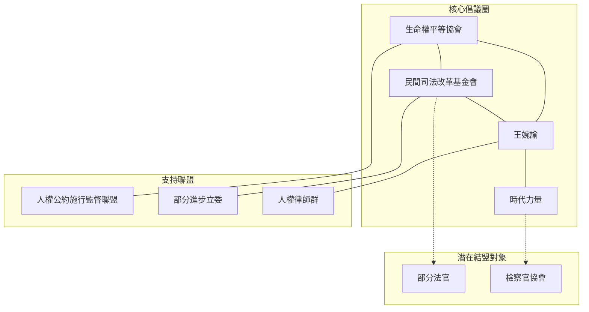

### 立場對立圖

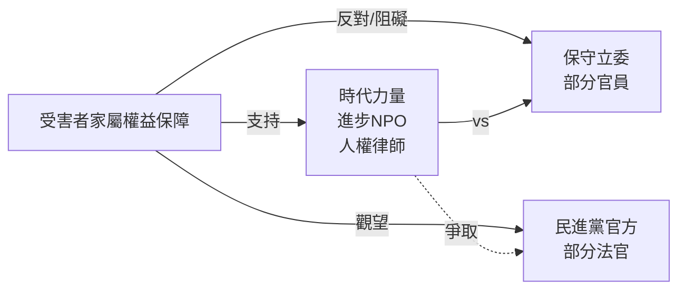

---

## 策略分析與建議

### 同盟策略建議

1. **強化現有同盟**
   - 與@時代力量、@生命權平等協會等維持密切合作
   - 定期舉辦聯合活動，擴大社會聲量

2. **爭取潛在支持者**
   - 目標：態度中立的法官、檢察官
   - 策略：舉辦專業研討會，提出技術面論述

3. **關注反對勢力動態**
   - 監控保守立委的動員情況
   - 準備相應的論述反擊

### 影響力最大化建議

1. **透過關鍵人物發聲**
   - @王婉諭具有最高的媒體關注度與道德權威
   - 善用其受害者家屬身份進行情感訴求

2. **擴大跨黨派支持**
   - 已有部分國民黨、民眾黨立委表示支持
   - 應持續爭取更多跨黨派連署

---

**報告製作**：Victim Rights News Tracker Skill  
**人物圖像建立方法**：參考 [tag-registry.md](tag-registry.md) 的角色立場追蹤章節

---

# 網站視覺化範本

本節提供將圖形資料庫匯出檔案整合至網站的 HTML/JavaScript 範本。

## Cytoscape.js 互動式圖表

### 基礎範本

```html
<!DOCTYPE html>
<html>
<head>
    <meta charset="UTF-8">
    <title>角色立場關係圖</title>
    <script src="https://unpkg.com/cytoscape@3.26.0/dist/cytoscape.min.js"></script>
    <style>
        body { margin: 0; font-family: 'Microsoft JhengHei', sans-serif; }
        #cy {
            width: 100vw;
            height: 100vh;
            background: #f8f9fa;
        }
        #info {
            position: absolute;
            top: 20px;
            left: 20px;
            background: white;
            padding: 15px;
            border-radius: 8px;
            box-shadow: 0 2px 8px rgba(0,0,0,0.1);
            max-width: 300px;
        }
        .legend {
            position: absolute;
            bottom: 20px;
            left: 20px;
            background: white;
            padding: 15px;
            border-radius: 8px;
            box-shadow: 0 2px 8px rgba(0,0,0,0.1);
        }
        .legend-item {
            display: flex;
            align-items: center;
            margin: 5px 0;
        }
        .legend-color {
            width: 20px;
            height: 20px;
            border-radius: 50%;
            margin-right: 10px;
        }
    </style>
</head>
<body>
    <div id="cy"></div>
    
    <div id="info">
        <h3>角色立場關係圖</h3>
        <p>點擊節點查看詳細資訊</p>
        <div id="node-details"></div>
    </div>
    
    <div class="legend">
        <h4>立場圖例</h4>
        <div class="legend-item">
            <div class="legend-color" style="background: #FF6B6B;"></div>
            <span>⭐⭐⭐⭐⭐ 強烈支持</span>
        </div>
        <div class="legend-item">
            <div class="legend-color" style="background: #FFA07A;"></div>
            <span>⭐⭐⭐⭐ 支持</span>
        </div>
        <div class="legend-item">
            <div class="legend-color" style="background: #FFD93D;"></div>
            <span>⭐⭐⭐ 中立</span>
        </div>
        <div class="legend-item">
            <div class="legend-color" style="background: #6BCB77;"></div>
            <span>⭐⭐ 消極</span>
        </div>
        <div class="legend-item">
            <div class="legend-color" style="background: #4D96FF;"></div>
            <span>⭐ 反對/阻礙</span>
        </div>
        <div class="legend-item">
            <div class="legend-color" style="background: #95A5A6;"></div>
            <span>未評估</span>
        </div>
        
        <h4 style="margin-top: 15px;">角色類型</h4>
        <div class="legend-item">
            <span>🔴 圓形 = 人物</span>
        </div>
        <div class="legend-item">
            <span>🟦 方塊 = 組織</span>
        </div>
        <div class="legend-item">
            <span>⬡ 六角形 = 政黨</span>
        </div>
    </div>

    <script>
        // 載入圖形資料
        fetch('stakeholders_cytoscape.json')
            .then(response => response.json())
            .then(data => {
                var cy = cytoscape({
                    container: document.getElementById('cy'),
                    
                    elements: data,
                    
                    style: [
                        // 節點樣式
                        {
                            selector: 'node',
                            style: {
                                'label': 'data(label)',
                                'width': 60,
                                'height': 60,
                                'font-size': '14px',
                                'text-valign': 'bottom',
                                'text-halign': 'center',
                                'text-margin-y': 8,
                                'color': '#2c3e50',
                                'font-weight': 'bold'
                            }
                        },
                        // 根據立場設置顏色
                        {
                            selector: 'node[stance = 5]',
                            style: { 'background-color': '#FF6B6B' }
                        },
                        {
                            selector: 'node[stance = 4]',
                            style: { 'background-color': '#FFA07A' }
                        },
                        {
                            selector: 'node[stance = 3]',
                            style: { 'background-color': '#FFD93D' }
                        },
                        {
                            selector: 'node[stance = 2]',
                            style: { 'background-color': '#6BCB77' }
                        },
                        {
                            selector: 'node[stance = 1]',
                            style: { 'background-color': '#4D96FF' }
                        },
                        {
                            selector: 'node[stance = 0]',
                            style: { 'background-color': '#95A5A6' }
                        },
                        // 根據類型設置形狀
                        {
                            selector: 'node[type = "organization"]',
                            style: { 'shape': 'round-rectangle' }
                        },
                        {
                            selector: 'node[type = "party"]',
                            style: { 'shape': 'hexagon' }
                        },
                        {
                            selector: 'node[type = "official"]',
                            style: { 'shape': 'diamond' }
                        },
                        // 邊的樣式
                        {
                            selector: 'edge',
                            style: {
                                'width': 2,
                                'line-color': '#95a5a6',
                                'target-arrow-color': '#95a5a6',
                                'target-arrow-shape': 'triangle',
                                'curve-style': 'bezier',
                                'label': 'data(label)',
                                'font-size': '12px',
                                'text-background-color': 'white',
                                'text-background-opacity': 0.8,
                                'text-background-shape': 'roundrectangle'
                            }
                        },
                        // 不同關係類型的顏色
                        {
                            selector: 'edge[type = "ally"]',
                            style: { 
                                'line-color': '#27ae60',
                                'target-arrow-color': '#27ae60'
                            }
                        },
                        {
                            selector: 'edge[type = "oppose"]',
                            style: { 
                                'line-color': '#e74c3c',
                                'target-arrow-color': '#e74c3c'
                            }
                        }
                    ],
                    
                    layout: {
                        name: 'cose',
                        padding: 50,
                        nodeRepulsion: 8000,
                        idealEdgeLength: 150,
                        nodeOverlap: 20,
                        animate: true
                    }
                });
                
                // 節點點擊事件
                cy.on('tap', 'node', function(evt) {
                    var node = evt.target;
                    var details = document.getElementById('node-details');
                    details.innerHTML = `
                        <h4>${node.data('label')}</h4>
                        <p><strong>類型：</strong>${node.data('type')}</p>
                        <p><strong>立場：</strong>${'⭐'.repeat(node.data('stance') || 0)}</p>
                        ${node.data('role') ? `<p><strong>職稱：</strong>${node.data('role')}</p>` : ''}
                        ${node.data('party') ? `<p><strong>所屬：</strong>${node.data('party')}</p>` : ''}
                        ${node.data('description') ? `<p><strong>說明：</strong>${node.data('description')}</p>` : ''}
                    `;
                });
                
                // 空白處點擊清除選擇
                cy.on('tap', function(evt) {
                    if (evt.target === cy) {
                        document.getElementById('node-details').innerHTML = '';
                    }
                });
            })
            .catch(error => {
                console.error('Error loading graph data:', error);
                document.getElementById('info').innerHTML += 
                    '<p style="color: red;">載入資料失敗，請確認 stakeholders_cytoscape.json 檔案存在</p>';
            });
    </script>
</body>
</html>
```

### 進階功能範本（含搜尋與篩選）

```html
<!-- 在基礎範本上增加搜尋與篩選功能 -->
<div id="controls" style="position: absolute; top: 20px; right: 20px; background: white; padding: 15px; border-radius: 8px; box-shadow: 0 2px 8px rgba(0,0,0,0.1);">
    <h4>篩選控制</h4>
    <input type="text" id="search" placeholder="搜尋人物..." style="width: 200px; padding: 8px; margin-bottom: 10px;">
    
    <div>
        <label><input type="checkbox" id="show-person" checked> 人物</label>
    </div>
    <div>
        <label><input type="checkbox" id="show-organization" checked> 組織</label>
    </div>
    <div>
        <label><input type="checkbox" id="show-party" checked> 政黨</label>
    </div>
    
    <h4 style="margin-top: 15px;">立場篩選</h4>
    <select id="stance-filter" style="width: 200px; padding: 8px;">
        <option value="all">全部</option>
        <option value="5">⭐⭐⭐⭐⭐ 強烈支持</option>
        <option value="4">⭐⭐⭐⭐ 支持</option>
        <option value="3">⭐⭐⭐ 中立</option>
    </select>
</div>

<script>
    // 搜尋功能
    document.getElementById('search').addEventListener('input', function(e) {
        var query = e.target.value.toLowerCase();
        cy.nodes().forEach(function(node) {
            var label = node.data('label').toLowerCase();
            if (label.includes(query)) {
                node.style('opacity', 1);
            } else {
                node.style('opacity', 0.2);
            }
        });
    });
    
    // 類型篩選
    ['person', 'organization', 'party'].forEach(function(type) {
        document.getElementById('show-' + type).addEventListener('change', function(e) {
            var nodes = cy.nodes('[type = "' + type + '"]');
            if (e.target.checked) {
                nodes.show();
            } else {
                nodes.hide();
            }
        });
    });
    
    // 立場篩選
    document.getElementById('stance-filter').addEventListener('change', function(e) {
        var stance = e.target.value;
        if (stance === 'all') {
            cy.nodes().show();
        } else {
            cy.nodes().hide();
            cy.nodes('[stance = ' + stance + ']').show();
        }
    });
</script>
```

## D3.js 力導向圖

### 基礎範本

```html
<!DOCTYPE html>
<html>
<head>
    <meta charset="UTF-8">
    <title>角色關係力導向圖</title>
    <script src="https://d3js.org/d3.v7.min.js"></script>
    <style>
        body { margin: 0; overflow: hidden; font-family: 'Microsoft JhengHei', sans-serif; }
        svg { width: 100vw; height: 100vh; }
        .node { cursor: pointer; }
        .node circle { stroke: #fff; stroke-width: 2px; }
        .node text { font-size: 12px; pointer-events: none; }
        .link { stroke: #999; stroke-opacity: 0.6; }
        .link-label { font-size: 10px; fill: #666; }
        #tooltip {
            position: absolute;
            background: white;
            padding: 10px;
            border-radius: 5px;
            box-shadow: 0 2px 5px rgba(0,0,0,0.2);
            pointer-events: none;
            opacity: 0;
            transition: opacity 0.2s;
        }
    </style>
</head>
<body>
    <svg></svg>
    <div id="tooltip"></div>

    <script>
        // 顏色映射
        const stanceColors = {
            5: '#FF6B6B', 4: '#FFA07A', 3: '#FFD93D',
            2: '#6BCB77', 1: '#4D96FF', 0: '#95A5A6'
        };
        
        // 載入資料
        fetch('stakeholders_d3.json')
            .then(response => response.json())
            .then(data => {
                const width = window.innerWidth;
                const height = window.innerHeight;
                
                const svg = d3.select('svg')
                    .attr('width', width)
                    .attr('height', height);
                
                // 建立力模擬
                const simulation = d3.forceSimulation(data.nodes)
                    .force('link', d3.forceLink(data.links).id(d => d.id).distance(150))
                    .force('charge', d3.forceManyBody().strength(-500))
                    .force('center', d3.forceCenter(width / 2, height / 2))
                    .force('collision', d3.forceCollide().radius(50));
                
                // 繪製連線
                const link = svg.append('g')
                    .selectAll('line')
                    .data(data.links)
                    .enter().append('line')
                    .attr('class', 'link')
                    .attr('stroke-width', 2);
                
                // 連線標籤
                const linkLabel = svg.append('g')
                    .selectAll('text')
                    .data(data.links)
                    .enter().append('text')
                    .attr('class', 'link-label')
                    .text(d => d.type);
                
                // 繪製節點
                const node = svg.append('g')
                    .selectAll('.node')
                    .data(data.nodes)
                    .enter().append('g')
                    .attr('class', 'node')
                    .call(d3.drag()
                        .on('start', dragstarted)
                        .on('drag', dragged)
                        .on('end', dragended));
                
                // 節點圓形
                node.append('circle')
                    .attr('r', 25)
                    .attr('fill', d => stanceColors[d.stance || 0]);
                
                // 節點標籤
                node.append('text')
                    .attr('dy', 35)
                    .attr('text-anchor', 'middle')
                    .text(d => d.name);
                
                // 滑鼠懸浮提示
                node.on('mouseover', function(event, d) {
                    d3.select('#tooltip')
                        .style('opacity', 1)
                        .style('left', (event.pageX + 10) + 'px')
                        .style('top', (event.pageY - 10) + 'px')
                        .html(`
                            <strong>${d.name}</strong><br>
                            類型：${d.group}<br>
                            立場：${'⭐'.repeat(d.stance || 0)}<br>
                            ${d.party ? '所屬：' + d.party : ''}
                        `);
                })
                .on('mouseout', function() {
                    d3.select('#tooltip').style('opacity', 0);
                });
                
                // 更新位置
                simulation.on('tick', () => {
                    link
                        .attr('x1', d => d.source.x)
                        .attr('y1', d => d.source.y)
                        .attr('x2', d => d.target.x)
                        .attr('y2', d => d.target.y);
                    
                    linkLabel
                        .attr('x', d => (d.source.x + d.target.x) / 2)
                        .attr('y', d => (d.source.y + d.target.y) / 2);
                    
                    node
                        .attr('transform', d => `translate(${d.x},${d.y})`);
                });
                
                // 拖曳功能
                function dragstarted(event, d) {
                    if (!event.active) simulation.alphaTarget(0.3).restart();
                    d.fx = d.x;
                    d.fy = d.y;
                }
                
                function dragged(event, d) {
                    d.fx = event.x;
                    d.fy = event.y;
                }
                
                function dragended(event, d) {
                    if (!event.active) simulation.alphaTarget(0);
                    d.fx = null;
                    d.fy = null;
                }
            });
    </script>
</body>
</html>
```

## GraphML 與專業工具

### 匯入 Neo4j

```cypher
// 清除現有資料（可選）
MATCH (n) DETACH DELETE n;

// 從 CSV 匯入節點
LOAD CSV WITH HEADERS FROM 'file:///stakeholders_nodes.csv' AS row
CREATE (n:Stakeholder {
    id: row.id,
    name: row.name,
    type: row.type,
    role: row.role,
    party: row.party,
    stance: toInteger(row.stance),
    description: row.description
});

// 從 CSV 匯入關係
LOAD CSV WITH HEADERS FROM 'file:///stakeholders_edges.csv' AS row
MATCH (source:Stakeholder {id: row.source})
MATCH (target:Stakeholder {id: row.target})
CREATE (source)-[r:RELATIONSHIP {
    type: row.type,
    interaction: row.interaction_type,
    date: row.date,
    description: row.description
}]->(target);

// 查詢所有支持者的同盟關係
MATCH (n:Stakeholder)-[r:RELATIONSHIP {type: 'ally'}]->(m:Stakeholder)
WHERE n.stance >= 4 AND m.stance >= 4
RETURN n.name, m.name, r.interaction
ORDER BY n.stance DESC;

// 查詢某人的網絡（深度2）
MATCH path = (center:Stakeholder {id: 'wang_wanyu'})-[:RELATIONSHIP*1..2]-(neighbor)
RETURN center, neighbor, relationships(path);
```

### 在 Gephi 中開啟

1. 開啟 Gephi
2. 資料實驗室 → 匯入電子表格
3. 選擇 `stakeholders_nodes.csv` 作為節點表
4. 選擇 `stakeholders_edges.csv` 作為邊表
5. 切換至概覽頁面，選擇布局算法（建議使用 Force Atlas 2）
6. 根據 stance 欄位設置節點顏色
7. 根據 type 欄位設置節點形狀

## 整合建議

### 網站架構建議

```
網站目錄結構
├── index.html                    # 主頁
├── stakeholder-network/          # 關係圖頁面
│   ├── index.html               # Cytoscape.js 視覺化
│   ├── stakeholders_cytoscape.json  # 圖形資料
│   └── d3/                      # D3.js 替代版本
│       ├── index.html
│       └── stakeholders_d3.json
├── data/                        # 原始資料下載
│   ├── stakeholders.graphml
│   ├── stakeholders_nodes.csv
│   └── stakeholders_edges.csv
└── reports/                     # 定期報告
    └── README.md
```

### 自動化更新流程

```bash
#!/bin/bash
# update-network.sh - 定期更新網站圖形資料

# 1. 執行每日新聞搜集
python victim-news-tracker.py --daily

# 2. 更新圖形資料庫
python scripts/graph_db.py --sync-from-reports

# 3. 匯出網站格式
python scripts/export_graph.py

# 4. 複製至網站目錄
cp export/stakeholders_cytoscape.json website/stakeholder-network/
cp export/stakeholders_d3.json website/stakeholder-network/d3/
cp export/*.csv website/data/

echo "網站圖形資料已更新"
```

### 效能最佳化建議

**大型網絡（1000+ 節點）**：
- 使用 WebGL 加速（Cytoscape.js 的 `layout: { name: 'cose-bilkent' }`）
- 啟用節點聚合（Clustering）功能
- 分層顯示（先顯示核心人物，再展開周邊）

**中小型網絡（<500 節點）**：
- 使用標準力導向布局即可
- 啟用所有互動功能（拖曳、搜尋、篩選）
- 可加入動畫效果提升視覺體驗

---

**視覺化範本版本**：v1.0  
**相容套件**：Cytoscape.js 3.x, D3.js 7.x  
**測試瀏覽器**：Chrome, Firefox, Safari, Edge
